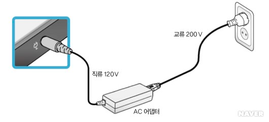
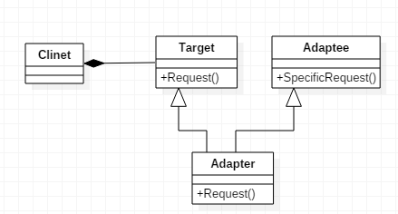
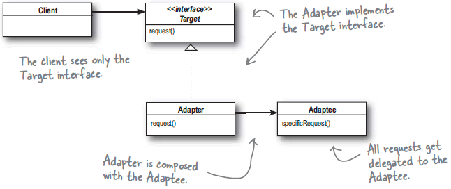

# Adapter Pattern

[어댑터 패턴 (Adapter Pattern)](https://johngrib.github.io/wiki/adapter-pattern/)

[[Design Pattern] 어댑터 패턴 (Adapter Pattern)](https://brownbears.tistory.com/493?category=378797)

[디자인패턴 - 어댑터 패턴(Adapter Pattern)](https://coding-start.tistory.com/256?category=808950)

[어댑터 패턴(Adapter Pattern)](https://www.crocus.co.kr/1540?category=337544)

[[Design Pattern] Adapter Pattern](https://beomseok95.tistory.com/253?category=1066005)

어댑터 패턴은 적응자 패턴, 래퍼(Wrapper) 패턴이라고도 불린다.

## 의도

> 클래스의 인터페이스를 사용자가 기대하는 인터페이스 형태로 적응(변환) 시킵니다. 서로 일치하지 않는 인터페이스를 갖는 클래스들을 함께 동작시킵니다. - GoF 책

> 한 클래스의 인터페이스를 클라이언트에서 사용하고자 하는 다른 인터페이스로 변환합니다. 어댑터를 이용하면 인터페이스 호환성 문제 때문에 같이 쓸 수 없는 클래스들을 연결해서 쓸 수 있습니다. - 헤드 퍼스트 디자인 패턴

## 예제 - 오리(헤드 퍼스트 디자인 패턴)

(생략)

---

한 클래스의 인터페이스를 다른 클래스에서 사용하고자 할 때, 다른 클래스에서 사용할 수 있도록 호환성을 제공해주는 패턴입니다. 예를 들어, 한국에서는 `220v`가 표준이지만 일본은 `110v`가 표준입니다. 한국에서 사용하는 충전기를 일본에 가져가면 호환이 되지 않아서 충전이 불가능합니다. 이 때, 돼지코와 같은 변환기(어댑터)를 사용해 한국에서 가져온 충전기를 일본에서 충전할 수 있도록 하는 기능이 여기서 말하는 어댑터 패턴이라 볼 수 있습니다.

## 예제 - 전자제품

(생략)

---

어댑터(adapter)의 의미에는 '접속 소켓', '확장 카드', '(물건을 다른 것에) 맞추어 붙이다', '맞추다' 등이 있다.

그림처럼 전원에서 오는 전기는 대개 교류 200V이지만 노트북은 직류 120V이다. 그러나 우리는 노트북을 사용할 때 아무런 불편 없이 노트북 선을 전원에 그대로 꽂아 사용한다. 이는 중간에 교류 200V를 직류 120V로 바꾸어 주는 무엇인가가 존재하기 때문이다. 이것이 노트북 선 중간에 붙어 있는 어댑터다.

1. 클래스 어댑터 패턴

    상속을 이용한 어댑터 패턴

   클래스 어댑터 패턴은 다중 상속을 허용하는 프로그래밍 언어에서만 사용 가능한 패턴이다.

   

    그림에서 `Client`는 `Target` 인터페이스를 사용하여 메서드를 호출한다. `Adapter`에서는 `Adaptee` 인터페이스를 사용하여 `concreteMethod` 호출로 변경한다. 이 때 `Client`는 중간에 `Adapter`가 존재한다는 것을 인식하지 못한다.

2. 인스턴스 어댑터 패턴

    구성(위임)을 이용한 어댑터 패턴

   

    객체 어댑터 패턴은 구성을 이용하여 어댑터 클래스를 구성한다. 클라이언트는 어댑터 인터페이스로만 의존하고 실제적인 어댑티는 알지 못한다.

---

우리가 사용하는 인터페이스와 다른 인터페이스를 제공하는 모듈이 있을 때, 그 중 누군가는 모듈을 인터페이스에 맞춰 변경해야 한다.

하지만 어떤 모듈도 그럴 수 없을 때, 어댑터는 클라이언트가 요청하는 타겟 인터페이스를 만족하게 하고 다른 인터페이스를 불러 서로 영향을 받지 않게 사용할 수 있도록 할 수 있다. 이것이 어댑터 패턴이다.

즉, 한 클래스의 인터페이스를 클라이언트에서 사용하고자 하는 다른 인터페이스로 변환시켜주는 역할을 한다. 이 때 어댑터를 이용하면 인터페이스 호환성때문에 같이 쓸 수 없는 클래스들을 연결해서 쓸 수 있다. 

> 타겟 인터페이스: 클라이언트가 요구하는 인터페이스를 의미한다.