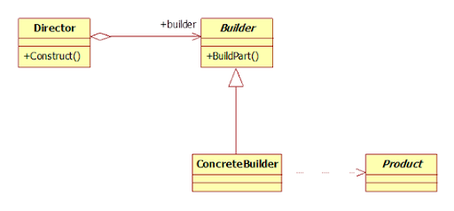

# Builder Pattern

[유니티 디자인패턴 - 빌더(Java와 GoF의 차이점) (Unity Design Patterns - Builder)](https://glikmakesworld.tistory.com/m/9)

[[GoF 디자인 패턴] 2. 빌더 패턴](https://medium.com/@sangw0804/gof-%EB%94%94%EC%9E%90%EC%9D%B8-%ED%8C%A8%ED%84%B4-2-%EB%B9%8C%EB%8D%94-%ED%8C%A8%ED%84%B4-3c56dc766d3b)

[디자인패턴 공부내용 정리 : 빌더 패턴](https://semtax.tistory.com/m/85)

[[디자인 패턴 4편] 생성 패턴, 빌더 (Builder)](https://dailyheumsi.tistory.com/187)

[빌더 패턴(Builder Pattern)](https://jdm.kr/blog/217)

## GoF Builder Pattern
새로운 객체를 만드는 방법론이라는 점은 Java의 빌더 패턴과 같지만, 전혀 관점이 다르다. Java의 빌더 패턴은 Set 함수를 여러개 써서 내가 원하는 변수를 세팅하고, `Build()` 후에는 멤버변수를 수정할 수 없게 해서 안전하게 보호하는 데에 목적이 있다. 반면 GoF의 빌더 패턴은 객체지향적인 방식인데, 예시를 통해 설명하겠다.

생과일 주스를 만드는 타이쿤 게임이 있다고 해보자. 손님이 원하는대로 포도주스, 딸기주스를 만들어서 줘야 한다. 기계에 과일을 넣고, 버튼을 눌러 즙을 짜서 손님에게 주는 것은 동일하지만, 재료가 포도냐 딸기냐에 따라 다르다.

설계


|클래스명|설명|
|---|---|
|Juice|손님에게 줄 주스. 멤버변수 type에 따라 포도주스 혹은 딸기주스가 됨|
|JuiceBuilder|주스 객체를 만들고 세팅하는데에 필요한 멤버함수나 멤버변수를 선언해주는 추상 클래스|
|StrawberryJuiceBuilder, GrapeJuiceBuilder|JuiceBuilder를 상속받아 딸기주스 혹은 포도주스를 만드는 기능을 정의할 수 있는 실질적인 객체|
|JuiceMachine|JuiceBuilder의 함수들을 사용해서 때로는 딸기주스 빌더, 때로는 포도|

```java
public class Juice
{
    public enum JuiceType
    {
        None,
        Grape,
        Strawberry
    }

    public JuiceType type = JuiceType.None;

    public void SetType(JuiceType type)
    {
        this.type = type;
    }
}
```

```java
public abstract class JuiceBuilder
{
    //만들어질 주스를 담을 변수
    protected Juice juice;

    //주스를 리턴
    public Juice CreateJuice()
    {
        return juice;
    }

    //새로운 주스를 만들 준비
    public void PrepareNewJuice()
    {
        juice = new Juice();
    }

    //주스를 만들기 전에 과일 세팅을 하는 추상함수. 내용물 정의는 하위 클래스에서 해줄 것이다.
    public abstract void SetFruit();
}
```

```java
//딸기주스 빌더
public class StrawberryJuiceBuilder : JuiceBuilder
{
    public override void SetFruit()
    {
        juice.SetType(Juice.JuiceType.Strawberry);
    }
}

//포도주스 빌더
public class GrapeJuiceBuilder : JuiceBuilder
{
    public override void SetFruit()
    {
        juice.SetType(Juice.JuiceType.Grape);
    }
}
```

```java
public class JuiceMachine
{
    //딸기주스빌더 혹은 포도주스빌더를 담을 변수.
    private JuiceBuilder juiceBuilder;

    //딸기주스빌더 혹은 포도주스빌더를 세팅하는 함수.
    public void SetJuiceBuilder(JuiceBuilder builder)
    {
        juiceBuilder = builder;
    }

    //빌더가 세팅되었다면 본격적으로 주스를 만들 준비를 한다.
    public void MakeJuice()
    {
        juiceBuilder.PrepareNewJuice();
        juiceBuilder.SetFruit();
    }

    //주스 만들 준비가 끝났다면 주스를 만들어서 손님에게 준다.
    public Juice GetJuice()
    {
        return juiceBuilder.CreateJuice();
    }
}
```

```java
public class AppMain : MonoBehaviour
{
    // Start is called before the first frame update
    void Start()
    {
        JuiceMachine machine = new JuiceMachine();
        GrapeJuiceBuilder grapeJuiceBuilder = new GrapeJuiceBuilder();
        StrawberryJuiceBuilder strawberryJuiceBuilder = new StrawberryJuiceBuilder();

        //포도주스 제조.
        machine.SetJuiceBuilder(grapeJuiceBuilder);
        machine.MakeJuice();
        Juice grapeJuice = machine.GetJuice();

        //딸기주스 제조.
        machine.SetJuiceBuilder(strawberryJuiceBuilder);
        machine.MakeJuice();
        Juice strawberryJuice = machine.GetJuice();

    }
}
```

---

GoF 빌더 패턴의 정의는 다음과 같다. '복잡한 객체를 생성하는 방법과 표현하는 방법을 정의하는 클래스를 분리해서 서로 다른 표현이라도 이를 생성할 수 있는 동일한 절차를 제공한다'

'표현'은 '조립'이라는 의미로 생각하면 이해하기 편할 듯 하다.

- 클래스 다이어그램

    

빌더 패턴의 클래스 구조는 상당히 심플하다. 복합 객체(`Product` 객체)의 표현(조립)을 담당하는 `Director` 클래스는 내부적으로 `Builder` 인터페이스의 구현체 객체를 포함하고 있고, `Builder` 구현체 클래스가 복합 객체의 각 구성요소의 생산을 담당한다.

```java
// Client.java

public class Client {
    public static void main(String[] args) {
        Director director = new Director(new ModernHouseBuilder());

        House house =  director.construct();
    }
}
```

```java
// Director.java


public class Director {
    private HouseBuilder builder;

    public Director(HouseBuilder builder) {
        this.builder = builder;
    }

    House construct() {
        builder.buildRoom(1);
        builder.buildRoom(2);

        builder.buildDoor(1, 2);

        return builder.getHouse();
    }
}
```

```java
// HouseBuilder.java

public interface HouseBuilder {
    void buildRoom(int roomNumber);
    void buildDoor(int oneRoomNumber, int theOtherRoomNumber);
    House getHouse();
}
```

```java
// ModernHouseBuilder.java

public class ModernHouseBuilder implements HouseBuilder {
    private House house = new House();

    @Override
    public void buildRoom(int roomNumber) {
        house.addRoom(roomNumber);
    }

    @Override
    public void buildDoor(int oneRoomNumber, int theOtherRoomNumber) {
        if (house.hasRoom(oneRoomNumber) && house.hasRoom(theOtherRoomNumber)) {
            house.addDoor(oneRoomNumber, theOtherRoomNumber);
        }
    }

    @Override
    public House getHouse() {
        return house;
    }
}
```

```java

```

위 코드를 보면 부품 생산 역할을 담당하는 `Builder` 클래스와 생산된 부품들을 얼마나, 어떻게 서로 표현(조립)할것인지를 담당하는 `Director` 클래스가 구분되어 있다. 이를 통해 `Builder` 내부 코드를 추상화하여 변경이 용이하고, 복잡한 객체를 생성하는 단계를 세밀하게 나누어서 다룰 수 있게 해준다.

Effective Java의 빌더 패턴을 사용하면 다음과 같은 장점을 얻을 수 있다.

1. 각 인자의 의미가 분명해지고
2. `.build()` 메소드 실행시에 한번에 객체가 생성되므로 일관성이 유지되고
3. setter 메소드를 추가하거나 할 필요가 없다.

## Effective Java Builder Pattern

객체를 만들 때 private 변수를 각각 개별 함수로 세팅하고, 변수설정이 끝났다면 객체를 만들어 반환하는 방법이다. 이때 만들어진 객체는 멤버변수를 다시는 수정할 수 없도록 해서 안전하게 보호할 수 있다.

```java
public class SaveData
{
    public string name{ get; private set; }
    public int level{ get; private set; }
    public string location{ get; private set; }

    public SaveData(string tName, int tLevel, string tLocation)
    {
        this.name = tName;
        this.level = tLevel;
        this.location = tLocation;
    }
    
    //세이브 데이터를 생성해주는 빌더 클래스.
    public class SaveDataBuilder
    {
        private string name = "defaultName";
        private int level = -1;
        private string location = "시작의 마을 여관";

        //개발자가 판단하기에 가장 중요한 변수는 생성자에 넣어서 반드시 세팅되도록 해준다.
        public SaveDataBuilder(string tName)
        {
            this.name = tName;
        }

        //이하는 Setter함수들. 리턴값으로 this를 해주는게 바로 포인트.
        public SaveDataBuilder SetLevel(int tLevel)
        {
            this.level = tLevel;
            return this;
        }

        public SaveDataBuilder SetLocation(string tLocationh)
        {
            this.location = tLocationh;
            return this;
        }

        //원하는 값들이 세팅되면 최종적으로 이 함수를 실행해서 세이브 데이터 객체를 하나 만들어준다.
        public SaveData Build()
        {
            return new SaveData(name, level, location);
        }
    }
}
```

```java
public class AppMain : MonoBehaviour
{
    // Start is called before the first frame update
    void Start()
    {
        //각 Set 함수를 실행하면 SaveDataBuilder가 리턴되기 때문에 걔속해서 .Set 이런식으로 멤버변수 세팅 가능. 
        //최종적으로 Build()를 실행하면 설정한 값에 따라 SaveData객체가 만들어짐.
        //이후엔 save1의 멤버변수를 수정할 방도가 없어서, 데이터를 보호할 수 있음.
        //만약 내가 설정하기 싫은 변수가 있으면 그 변수에 대한 Set함수를 사용 안하면 된다.
        SaveData save1 = new SaveData.SaveDataBuilder("글릭").SetLevel(1).SetLocation("발라마을 여관").Build();

    }
}
```

---

빌더 패턴 - 생성 패턴 중 하나

- 배경
    
    복잡한 객체를 생성하는데 초기화를 단계별로 해야할 때, 어떻게 깔끔하게 코드를 작성할 수 있을까를 고민하다 나온 패턴
    
    ex) 자동차 조립, 피자 만들기

- 상황
  
    피자라는 객체를 만든다고 가정해보자. 피자에는 올리브 토핑, 페퍼로니 토핑, 피망, 고기도 들어갈 수 있다. 하지만 저 재료들을 무조건 넣어야하는 게 아니고 선택적으로 넣는다.

    일단 가장 단순한 방법은 이런 케이스를 모두 커버하는 생성자를 만드는 것이다. 그럼 코드가 상당히 지저분하게 나온다.

    ```java
    public class Pizza {
          private String pepperoni;
          private String paprika;
          private String meat;
          private String olive;
          private String cheese;
          private String bread;
        
          public Pizza() {
        
          }
        
          public Pizza(String bread) {
            this.bread = bread;
          }
        
          public Pizza(String bread, String cheese) {
            this.bread = bread;
            this.cheese = cheese;
          }
        
          ...
    }
    ```

- 해결법
  
    위에서 선언했던 모든 생성자들을 빌더라는 별도 클래스로 추출한다.

    그리고 추출한 각 생성자들을 빌더 클래스의 메서드로 만든다. 이 때, 빌더 클래스의 메서드들이 빌더 객체 자신을 리턴하게 해서 위에서 선언한 함수들을 연속적으로 호출할 수 있게 하는 방식으로 구현한다.

    마지막으로 `build` 메서드를 호출하면 실제로 빌더 클래스가 생성한 객체를 돌려준다.

- 구현법
  
    ```java
    public class Pizza {
    
          private String pepperoni;
          private String paprika;
          private String meat;
          private String olive;
          private String cheese;
          private String bread;
        
          public Pizza(String bread, String cheese, String pepperoni, String paprika, String meat, String olive) {
                this.bread = bread;
                this.cheese = cheese;
                this.pepperoni = pepperoni;
                this.paprika = paprika;
                this.meat = meat;
                this.olive = olive;
          }
    }
    ```

    ```java
    public class PizzaBuilder {

          private String pepperoni;
          private String paprika;
          private String meat;
          private String olive;
          private String cheese;
          private String bread;
        
          public PizzaBuilder(String bread, String cheese) {
                this.bread = bread;
                this.cheese = cheese;
          }
        
          public PizzaBuilder addPaprika(String paprika) {
                this.paprika = paprika;
          }
        
        
          public PizzaBuilder addMeat(String meat) {
                this.meat = meat;
          }
        
          public PizzaBuilder addOlive(String olive) {
                this.olive = olive;
          }
        
          public PizzaBuilder addPepperoni(String pepperoni) {
                this.pepperoni = pepperoni;
          }
        
          public Pizza build(){
                return new Pizza(this.bread, this.cheese, this.pepperoni, this.paprika, this.meat, this.olive);
          }
    }
    ```
    
    ```java
    public class Main {
          public static void main(String[] args) {
                PizzaBuilder builder = new PizzaBuilder("crust","pamasan");
                Pizza nicePizza = builder.addPaprika("yellow paprika")
                      .addMeat("cow meat")
                      .addOlive("black olive")
                      .addPepperoni("red pepperoni")
                      .build();
          }
    }
    ```

- 예시
    - `Retrofit2` [Github](https://square.github.io/retrofit/)

        ```java
        public interface GitHubService {
              @GET("users/{user}/repos")
              Call<List<Repo>> listRepos(@Path("user") String user);
        }
            
        ...
        
        Retrofit retrofit = new Retrofit.Builder()
            .baseUrl("https://api.github.com/")
            .build();
        
        GitHubService service = retrofit.create(GitHubService.class);
        ```

---

1. 개념

    > 빌더 패턴은 생성 인자가 많을 때, 빌더 객체를 통해 구체적인 객체를 생성한다.
  
  1. 장점

    - 객체 생성에 필요한 파라미터의 의미를 코드단에서 명확히 알 수 있다(가독성).
    - 생성에 필요한 파라미터가 추가될 때마다 생성자 오버로딩을 안해도 된다.

  2. 단점

    - 추가적으로 빌더 클래스를 구현해야 한다.

  3. 활용 상황

      생성자 인자가 많은 경우

      ```java
      WebBrowser browser = new WebBrowser();
      browser.setSslEnabled(true);
      browser.setPlugins(new FlashPlugin());
      browser.setCookieEnabled(true);
      ```
     
      ```java
      WebBrowser browser = new BrowserBuilder()
          .withSsl()
          .withFlashPlugin()
          .withCookieSupport()
          .build();
      ```

2. 구조 & 코드

- 불필요한 생성자를 만들지 않고 객체를 만든다.
- 데이터의 순서에 상관 없이 객체를 만들어 낸다.
- 사용자가 봤을때 명시적이고 이해할 수 있어야 한다.

```java

```

```java
public class PersonInfoBuilder {
  private String name;
  private Integer age;
  private String favoriteColor;
  private String favoriteAnimal;
  private Integer favoriteNumber;

  public PersonInfoBuilder setName(String name) {
    this.name = name;
    return this;
  }

  public PersonInfoBuilder setAge(Integer age) {
    this.age = age;
    return this;
  }

  public PersonInfoBuilder setFavoriteColor(String favoriteColor) {
    this.favoriteColor = favoriteColor;
    return this;
  }

  public PersonInfoBuilder setFavoriteAnimal(String favoriteAnimal) {
    this.favoriteAnimal = favoriteAnimal;
    return this;
  }

  public PersonInfoBuilder setFavoriteNumber(Integer favoriteNumber) {
    this.favoriteNumber = favoriteNumber;
    return this;
  }

  public PersonInfo build(){
    PersonInfo personInfo = new PersonInfo(name, age, favoriteColor, favoriteAnimal, favoriteNumber);
    return personInfo;
  }
}
```

```java

public class BuilderPattern {
  public static void main(String[] args) {
    // 빌더 객체를 하나 만듭니다.
    PersonInfoBuilder personInfoBuilder = new PersonInfoBuilder();
    // 빌더 객체에 원하는 데이터를 입력합니다. 순서는 상관 없습니다.
    PersonInfo result = personInfoBuilder
            .setName("MISTAKE")
            .setAge(20)
            .setFavoriteAnimal("cat")
            .setFavoriteColor("black")
            .setName("JDM") // 다시 같은 메소드를 호출한다면 나중에 호출한 값이 들어갑니다.
            .setFavoriteNumber(7)
            // 마지막에 .build() 메소드를 호출해서 최종적인 결과물을 만들어 반환합니다.
            .build();
    // print is "name:JDM, age:20, favoriteColor:black, favoriteAnimal:cat, favoriteNumber:7"
    System.out.println(result.getPersonInfo());
  }
}
```

1. `setter`의 리턴값으로 `this`를 써서 활용하는 입장에서는 체임 형식으로 메서드를 호출할 수 있게 했다.
2. `build`로 최종적으로 `builder`에 담긴 정보를 이용해 객체를 만든다.

- 빌더 클래스를 객체를 만들어낼 클래스와 꼭 분리할 필요는 없다. 객체를 만들어낼 클래스 내부에 빌더 클래스를 포함해서 다음과 같이 만들 수 있다.

  ```java
  PersonInfo p = PersonInfo.Builder().setName("JDM").setAge(20).build();
  ```
  
  ```java
  /* PersionInfo.java */
  public static PersonInfoBuilder Builder(){
    return new PersonInfoBuilder();
  }
  ```


