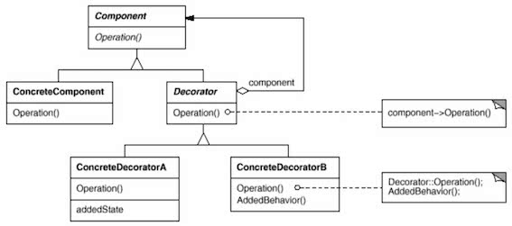
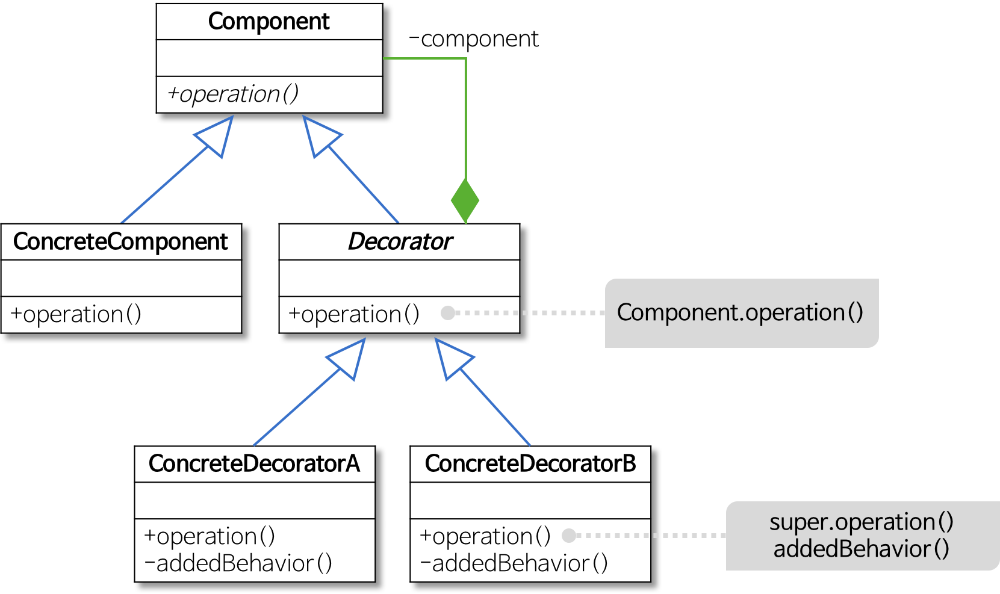
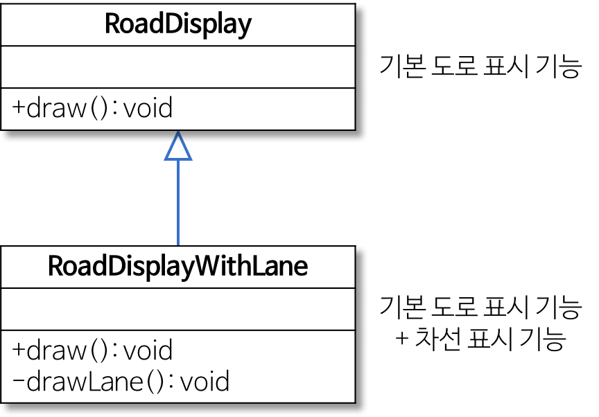
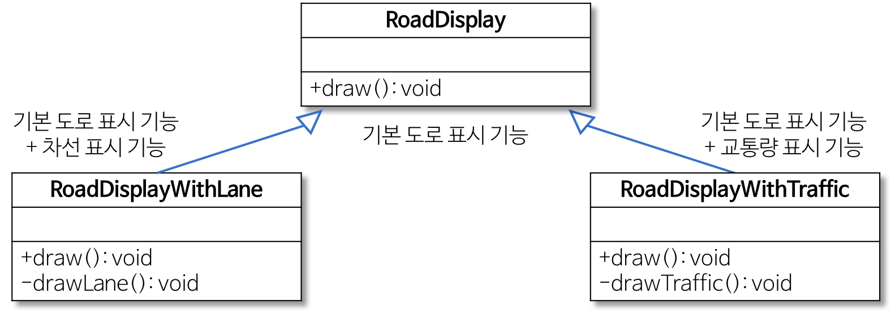
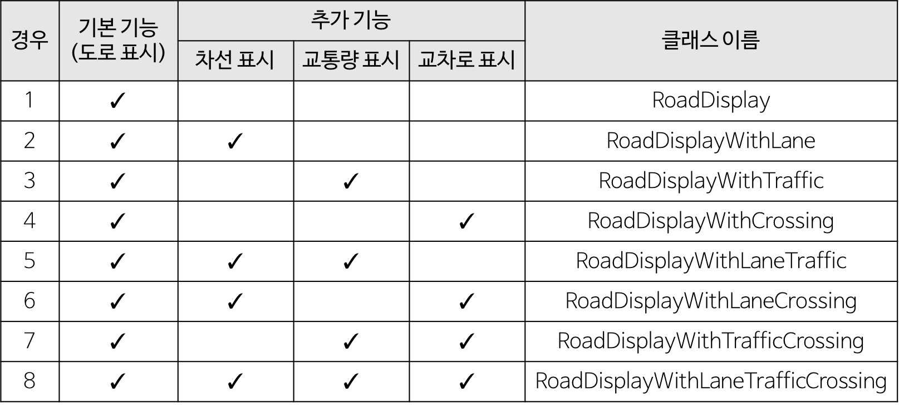
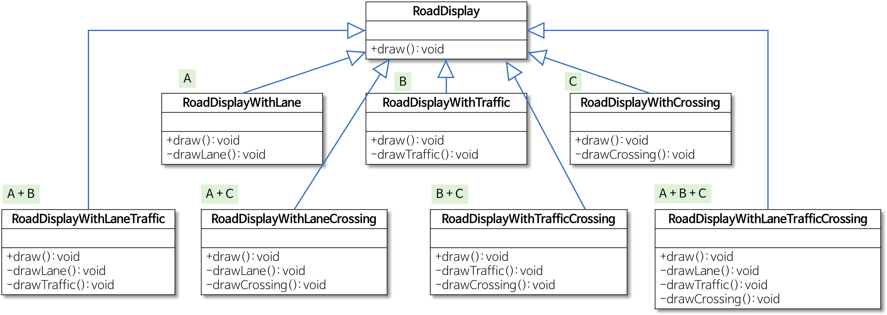

# Decorator Pattern

[데코레이터 패턴(Decorator Pattern)](https://jdm.kr/blog/78)

[데코레이터 패턴 (Decorator Pattern)](https://johngrib.github.io/wiki/decorator-pattern/#%EC%96%B4%EB%94%94%EC%97%90%EC%84%9C-%EC%82%AC%EC%9A%A9%ED%95%98%EA%B3%A0-%EC%9E%88%EB%82%98)

[[Design Pattern] 데코레이터 패턴이란](https://gmlwjd9405.github.io/2018/07/09/decorator-pattern.html)

1. 정의
    
   객체를 확장할 때 서브 클래스를 이용해 동적(dynamic)으로 확장한다.

2. 예제
   
   (생략)

3. 정리
    
    `ArrayList` 등으로 중복된 맛을 하나로 뭉쳐서 처리할 수 있다면 더 좋았겠지만 일단 간단하게 나열만 했다.
   
    이러한 데코레이터 패턴이 많이 보이는 자바 API는 파일 I/O 관련 부분이다. 자바에서 파일을 읽어들일 때 보통 다음처럼 사용한다.
   
    ```java
    // Example - Read a file
    BufferedReader br = new BufferedReader(new FileReader(new File("test.txt")));
    ```
   
    보다시피 데코레이터 패턴을 사용해서 유연하게 기능 확장을 할 수 있지만, 대신 각각의 데코레이터 클래스들이 어떤 기능을 수행하는지 알고 있어야 하고 자잘한 클래스들이 많이 생기는 것이 단점이므로 적절하게 활용해야 한다.

---

> 객체에 동적으로 새로운 책임을 추가한다

데코레이터 패턴(decorator pattern)은 장식자 패턴, 랩퍼 패턴(wrapper pattern)이라고도 불린다.

## 의도

GoF 책에서는 다음과 같이 패턴의 의도를 밝힌다.

> 객체에 동적으로 새로운 책임을 추가할 수 있게 합니다. 기능을 추가하려면, 서브클래스를 생성하는 것보다 융통성 있는 방법을 제공합니다.

이어서 다음과 같은 동기를 소개한다.

> 가끔 전체 클래스에 새로운 기능을 추가할 필요는 없지만, 개별적인 객체에 새로운 책임을 추가할 필요가 있습니다. 예를 들어, GUI 툴킷에서 모든 사용자 인터페이스 요소에는 필요 없지만, 어떤 사용자 인터페이스 요소에만 스크롤링(scrolling)과 같은 행동이나 테두리(border)와 같은 속성을 추가할 수 있도록 해 줄 필요는 있습니다. 이런 것은 하나의 객체에 속성이 추가됨으로써 또 다른 책임이 추가되어야 합니다.  

> 이렇게 새로운 서비스의 추가가 필요할 때 이를 해결하는 일반적인 방법은 상속을 이용하는 것입니다. 즉, 이미 존재하는 클래스를 상속받고, 또 다른 클래스에서 테두리 속성을 상속받아 이 서브클래스의 인스턴스에 테두리가 있도록 하는 방법이지만, 별로 유용하지는 않습니다. 테두리의 선택이 정적이기 때문입니다. 사용자는 구성요소를 언제, 그리고 어떻게 테두리로 장식해야 할지 제어할 수 없습니다.  

> 더 나은 방법은 지금 필요한 테두리를 추가하는 다른 객체에다가 해당 구성요소를 둘러싸는 것입니다. 이렇게 무엇인가를 감싸는 객체를 장식자(decorator)라고 합니다. 장식자는 자신이 둘러싼 요소, 구성요소가 갖는 인터페이스를 자신도 동일하게 제공하므로, 장식자의 존재는 이를 사용하는 사용자에게 감춰집니다. 즉, 장식자는 자신이 둘러싼 구성요소로 전달되는 요청을 중간에 가로채서 해당 구성요소에 전달해 줍니다. 그렇기 때문에 이 전달 과정의 앞뒤에 다른 작업(이를 테면, 테두리 그리기 등)을 추가로 할 수 있습니다. 여기에는 투명성이 존재하기 때문에 장식자의 중첩이 가능하며, 이를 통해 책임 추가를 무한정으로 할 수 있습니다.

## 구조



## 언제 사용하는가?

- 객체의 타입과 호출 가능한 메소드를 그대로 유지하면서 객체에 새로운 책임을 추가할 때 사용한다.
- 탈부착 가능한 책임을 정의할 때 사용한다.
- 상속을 통해 서브클래스를 계속 만드는 방법이 비효율적일 때 사용한다.
   - 특히 조합되는 경우의 수가 많으면 서브클래스 수가 폭발적으로 늘어날 수 있다.

## 구현할 때 고려할 점들

- `Component`는 장식을 추가할 베이스가 되는 역할이므로 작고 가볍게 정의하도록 한다.
   - 가급적 인터페이스만을 정의한다.
   - 무언가 저장하는 변수는 정의하지 않는다(상속받는 여러 `Decorator`도 같이 복잡하고 무거워진다).
   - 저장할 것이 있다면 서브클래스에서 하자.
- 상속 구조를 통해 `Decorator`와 `Component`가 같은 인터페이스를 갖게 해야 한다.
   - 투과적 인터페이스: `Decorator`로 계속해서 감싸도 `Component`의 메소드는 계속 사용할 수 있다.
- 코드를 수정하지 않고도 준비된 `Decorator`를 조합해 기능을 추가할 수 있도록 생각해서 구현한다.
- 비슷한 성질의 작은 클래스가 많이 만들어질 수 있다는 단점을 고려한다.
- 구현하려는 내용이 객체의 겉을 변경하려는 것인지, 속을 변경하려는 것인지 생각해보자.
   - 속을 변경하려는 것이라면 Strategy Pattern을 선택하는 것이 더 적절할 수 있다.
- 데코레이터 패턴으로 구현한 다음, 사용이 까다롭게 느껴지거나 자주 쓰는 조합이 있다면 다음 패턴을 사용해 제공하는 것을 고려해 보자.
   - Builder Pattern
   - Factory Pattern
   - Static Factory Method Pattern
- `Decorator`가 다른 `Decorator`에 대해 알아야할 필요가 있다면, 데코레이터 패턴의 사용 의도와 어긋나는 작업일 수 있다.
- 재귀적으로 기능을 갖게 하는 방법 외에도, `Decorator`를 추가할 때마다 얻은 아이템을 List로 관리하는 방법도 있다.

    <https://stackoverflow.com/questions/43565475/using-lists-instead-of-decorator-pattern>

## 예제

음료와 첨과물 (생략)

## 어디에서 사용하고 있나?
`java.io` 패키지에서 데코레이터 패턴을 사용한다.

`InputStream`의 경우를 살펴보자.

- `InputStream` (추상 component 역할)
   - `FileInputStream`
   - `StringBufferInputStream`
   - `ByteArrayInputStream`
   - `FilterInputStream` (추상 decorator 역할)
      - `PushbackInputStream`
      - `BufferedInputStream`
      - `DataInputStream`
      - `LineNumberInputStream`

헤드 퍼스트 디자인 패턴에서는 이를 응용하여 `LowerCaseInputStream` 데코레이터를 추가하는 예제를 보여준다.

```java
class LowerCaseInputStream extends FilterInputStream {
public LowerCaseInputStream(InputStream in) {
super(in);
}

    public int read() throws IOException {
        int c = super.read();
        if (c == -1) {
            return c;
        }
        return Character.toLowerCase(c);
    }
}
```
한편 "Java 언어로 배우는 디자인 패턴 입문"에서는 Reader를 사용하는 예제를 보여준다.4

```java
// 버퍼링 + 파일에서 읽기
Reader reader = new BufferedReader(
    new FileReader("test.txt")
);
```

```java
// 행 번호 관리 + 버퍼링 + 파일에서 읽기
Reader reader = new LineNumberReader(
   new BufferedReader(
      new FileReader("test.txt")
   )
);
```

```java
// 행 번호 관리 + 파일에서 읽기
Reader reader = new LineNumberReader(
   new FileReader("test.txt")
);
```

```java
java.net.Socket socket = new Socket(hostname, portNumber);

// 행 번호 관리 + 버퍼링 + 네트워크에서 읽기
Reader reader = new LineNumberReader(
  new BufferedReader(
      new InputStreamReader(socket.getInputStream())
  )
);
```

---

## 데코레이터 패턴이란

- **객체의 결합을 통해 기능을 동적으로 유연하게 확장**할 수 있게 해주는 패턴

    - 즉, 기본 기능에 추가할 수 있는 기능의 종류가 많은 경우에 각 추가 기능을 Decorator 클래스로 정의한 후 필요한 Decorator 객체를 조합함으로써 추가 기능의 조합을 설계하는 방식이다.
    
    - ex) 기본 도로 표시 기능에 차선 표시, 교통량 표시, 교차로 표시, 단속 카메라 표시의 4가지 추가 기능이 있을 때 추가 기능의 모든 조합은 15가지가 된다.
    
        -> 데코레이터 패턴을 이용하여 필요한 추가 기능의 조합을 동적으로 생성할 수 있다.
    
    - 구조(Structural) 패턴 중 하나
    
        
    
        
    
    - 기본 기능에 추가할 수 있는 많은 종류의 부가 기능에서 파생되는 다양한 조합을 동적으로 구현할 수 있는 패턴이다.
    
    - 역할이 수행하는 작업
        - `Component`
          - 기본 기능을 뜻하는 `ConcreteComponent`와 추가 기능을 뜻하는 `Decorator`의 공통 기능을 정의. 즉, 클라이언트는 `Component`를 통해 실제 객체를 사용함
        - `ConcreteComponent`
          - 기본 기능을 구현하는 클래스
        - `Decorator`
          - 많은 수가 존재하는 구체적인 `Decorator`의 공통 기능을 제공
        - `ConcreteDecoratorA, ConcreteDecoratorB`
          - `Decorator`의 하위 클래스로 기본 기능에 추가되는 개별적인 기능을 뜻함 
          - `ConcreteDecorator` 클래스는 `ConcreteComponent` 객체에 대한 참조가 필요한데, 이는 `Decorator` 클래스에서 `Component` 클래스로의 합성(composition) 관계를 통해 표현됨

- 구조(Structural) 패턴
    - 클래스나 객체를 조합해 더 큰 구조를 만드는 패턴
    - 예를 들어 서로 다른 인터페이스를 지닌 2개의 객체를 묶어 단일 인터페이스를 제공하거나 객체들을 서로 묶어 새로운 기능을 제공하는 패턴
- 합성 관계
  - 생성자에서 필드에 대한 객체를 생성하는 경우 전체 객체의 라이프타임과 부분 객체의 라이프 타임은 의존적이다.
  - 즉, 전체 객체가 없어지면 부분 객체도 없어진다.
    
## 예시 - 도로 표시 방법 조합하기



- 내비게이션 SW 기능
    - 기본 기능: 도로를 간단한 선으로 표시하는 기능
    - 추가 기능: 내비게이션 SW에 따라 도로의 차선을 표시하는 기능
    
### 문제점

1. 또 다른 도로 표시 기능을 추가로 구현하는 경우
    - 기본 도로 표시에 교통량을 표시하고 싶다면?
    
    
2. 여러 가지 추가 기능을 조합해야 하는 경우

    
   
    