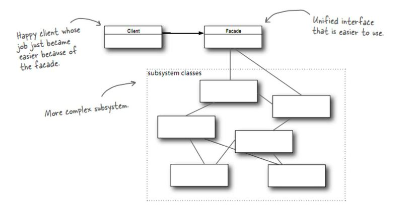
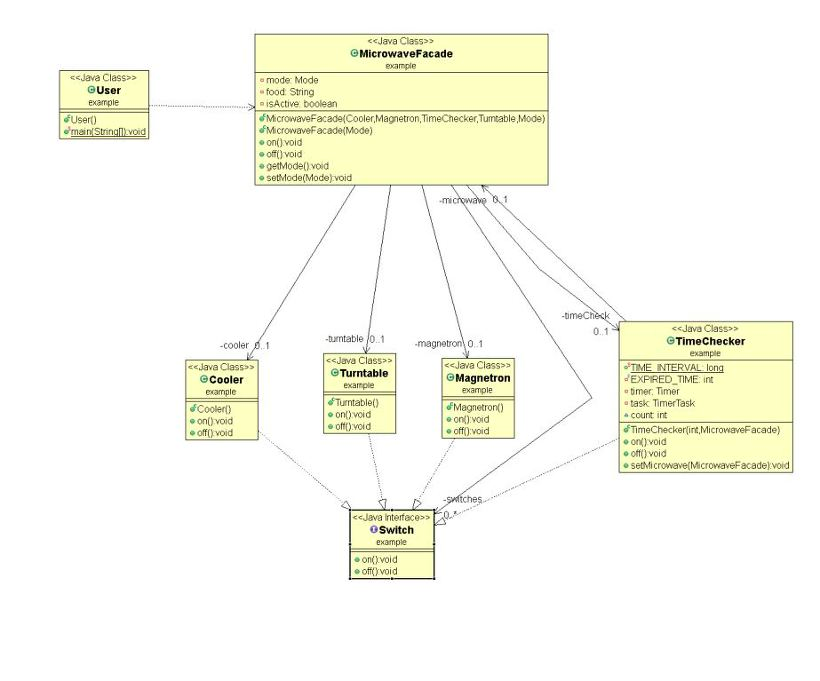

# Facade Pattern

[[디자인패턴] 퍼사드 패턴 (Facade Pattern)](https://gdtbgl93.tistory.com/142)

[09 퍼사드 패턴 (Facade Pattern)](https://lktprogrammer.tistory.com/42)

어떤 서브시스템의 일련의 인터페이스에 대해 통합된 인터페이스를 제공합니다. 퍼사드에서 고수준 인터페이스를 정의하기 때문에 서브시스템을 더 쉽게 사용할 수 있습니다.

> 퍼사드(Facade): 프랑스어 Façade 에서 유래된 단어로 건물의 외관이라는 뜻을 가지고 있습니다. 건물의 외벽에서 보면 안의 구조는 보이지 않습니다.

> Facade는 "건물의 정면"을 의미하는 단어로 어떤 소프트웨어의 다른 커다란 코드 부분에 대하여 간략화된 인터페이스를 제공해주는 디자인 패턴을 의미합니다. 퍼사드 객체는 복잡한 소프트웨어의 바깥쪽 코드가 라이브러리 안쪽 코드에 의존하는 일을 감소시켜 주고, 복잡한 소프트웨어를 사용할 수 있게 간단한 인터페이스를 제공합니다.

퍼사드 패턴을 이용하면 많은 서브시스템(내부 구조)을 거대한 클래스(클래스)로 감싸서 편리한 인터페이스를 제공합니다.

- 쿨러
  - 전자레인지의 열을 식힌다.
- 마그네트론
  - 마이크로파를 발생시킨다.
- 턴테이블
  - 조리할 음식을 회전시킨다.
- 타이머
  - 시간이 되면 전자레인지를 끈다.

퍼사드 클래스가 서브시스템의 클래스들을 캡슐화하는 것은 아닙니다. 기능을 편하게 사용할 수 있도록 인터페이스를 제공할 뿐입니다(-> 접근지정자 `default`).

- 최소 지식 원칙
    - **정말 관련있는 객체와 관계를 맺어라**
    - 객체 자체
    - 메소드에 매개변수로 전달된 객체
    - 그 메소드에서 생성하거나 인스턴스를 만든 객체
    - 그 객체에 속하는 구성요소
    - 이 종류의 메소드만 호출하면 이 원칙을 지킬 수 있습니다.
    - 의존성을 낮춰 관리를 용이하게 해주는 것이 핵심입니다. 하지만 다른 메소드를 호출하기 위한 래퍼클래스를 만들어야 하는 등의 단점도 생길 수 있으니 상황에 따라 잘 선택하는 것이 좋겠습니다.
    
---

