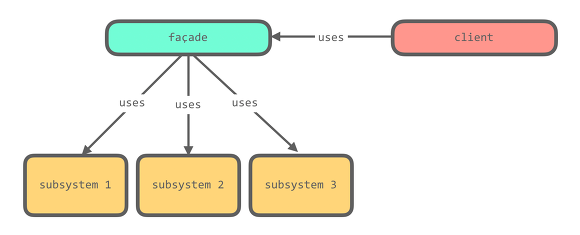
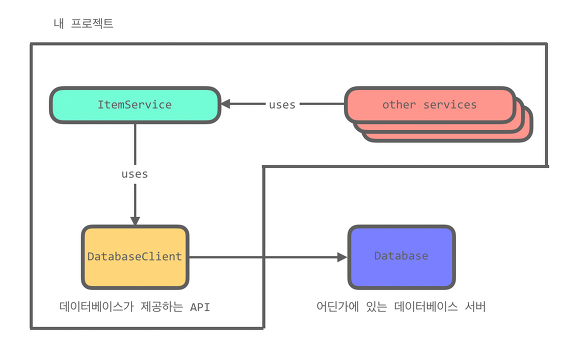

# Facade Pattern

[[디자인패턴] 퍼사드 패턴 (Facade Pattern)](https://gdtbgl93.tistory.com/142)

[09 퍼사드 패턴 (Facade Pattern)](https://lktprogrammer.tistory.com/42)

[퍼사드 패턴(Façade Pattern)](https://imasoftwareengineer.tistory.com/29)

[디자인패턴 - 퍼사드패턴(Facede pattern)](https://coding-start.tistory.com/197)




어떤 서브시스템의 일련의 인터페이스에 대해 통합된 인터페이스를 제공합니다. 퍼사드에서 고수준 인터페이스를 정의하기 때문에 서브시스템을 더 쉽게 사용할 수 있습니다.

> 퍼사드(Facade): 프랑스어 Façade 에서 유래된 단어로 건물의 외관이라는 뜻을 가지고 있습니다. 건물의 외벽에서 보면 안의 구조는 보이지 않습니다.

> Facade는 "건물의 정면"을 의미하는 단어로 어떤 소프트웨어의 다른 커다란 코드 부분에 대하여 간략화된 인터페이스를 제공해주는 디자인 패턴을 의미합니다. 퍼사드 객체는 복잡한 소프트웨어의 바깥쪽 코드가 라이브러리 안쪽 코드에 의존하는 일을 감소시켜 주고, 복잡한 소프트웨어를 사용할 수 있게 간단한 인터페이스를 제공합니다.

퍼사드 패턴을 이용하면 많은 서브시스템(내부 구조)을 거대한 클래스(클래스)로 감싸서 편리한 인터페이스를 제공합니다.


- 쿨러
  - 전자레인지의 열을 식힌다.
- 마그네트론
  - 마이크로파를 발생시킨다.
- 턴테이블
  - 조리할 음식을 회전시킨다.
- 타이머
  - 시간이 되면 전자레인지를 끈다.

퍼사드 클래스가 서브시스템의 클래스들을 캡슐화하는 것은 아닙니다. 기능을 편하게 사용할 수 있도록 인터페이스를 제공할 뿐입니다(-> 접근지정자 `default`).

- 최소 지식 원칙
    - **정말 관련있는 객체와 관계를 맺어라**
    - 객체 자체
    - 메소드에 매개변수로 전달된 객체
    - 그 메소드에서 생성하거나 인스턴스를 만든 객체
    - 그 객체에 속하는 구성요소
    - 이 종류의 메소드만 호출하면 이 원칙을 지킬 수 있습니다.
    - 의존성을 낮춰 관리를 용이하게 해주는 것이 핵심입니다. 하지만 다른 메소드를 호출하기 위한 래퍼클래스를 만들어야 하는 등의 단점도 생길 수 있으니 상황에 따라 잘 선택하는 것이 좋겠습니다.
    
---

퍼사드 패턴은 디자인 패턴 중에서도 꽤 많이 사용되는 패턴임에도 불구하고 디자인 패턴을 처음 배우는 입문자들에게는 헷갈리는 개념이다. 그 이유는 퍼사드 패턴이 가져다주는 장점이 입문자 입장에서는 잘 이해되지 않기 때문이다. 이는 디자인 패턴을 처음 배우는 사람들이 큰 소프트웨어를 접해볼 기회가 별로 없어서이기도 하고, 현업에서 퍼사드 패턴이 사용되었음을 특별히 명시하지 않고 Service 형태로 많이 이용하기 때문이기도 하다.

퍼사드 패턴의 목적은 복잡한 서브시스템을 인터페이스로 감싸 간단하게 만드는 것이다. 또한 퍼사드 패턴은 제 3의 API(Third Party API) 같은 외부 라이브러리를 추상화 하는 데에도 사용된다.

다양한 서브시스템이 함께 이용되는 시스템에서 퍼사드 클래스는 이 서브시스템들을 추상화할 수 있다. 클라이언트는 서브시스템의 존재를 모르고 오직 퍼사드 클래스만 알고 있으며, 퍼사드 클래스만 접근할 수 있다. 이렇게 하면 클라이언트는 서브시스템으로부터 분리되어(Decouple) 서브시스템에 의존하지 않아도 된다.

## 실사용 예시



이 프로젝트에서는 어떤 데이터베이스 서비스가 제공하는 3rd party API인 DatabaseClient를 이용해 데이터베이스 서버와 통신했다. 코드는 간략하게 다음과 같았다. 위의 코드는 보안을 위해 서비스이름, 실제 일어났던 사안 (데이터베이스 API가 아닌 다른 API)이 아니라 그 때의 상황을 재현 한 것이다.

`DatabaseClient.java` (다시 말하지만 이 코드는 우리가 짠 코드가 아니라 데이터베이스쪽에서 받아오는 코드이다. 따라서 이 코드는 수정이 불가능하며 사용만 가능하다.)

```java
package ThirdPartyAPI;

public class DatabaseClient {
    public DatabaseClient () {}

    public void find(final String table, final String primaryKey, final Integer maxRetry) {
        // Database Request to the DB Server
    }
}
```

`ItemService.java`

```java
import ThirdPartyAPI.DatabaseClient;

public class ItemService {
  private final DatabaseClient databaseClient;
  
  public ItemService() {
    databaseClient = new DatabaseClient();
  }
  
  public void find(final String primaryKey) {
    databaseClient.find("Item", primaryKey, 3);
  }
}
```

`Client.java`

```java
public class Client {
    public static void main(String[] args) {
        ItemService itemService = new ItemService();
        itemService.find("3");
    }
}
```

어떤 이유에선지 ItemService라는 녀석이 DatabaseClient를 캡슐화 하고 있었고, 여러개도 아닌 하나의 서브시스템을 ItemService로 감싸는 이유를 나는 당시에 잘 몰랐었다. 하지만 어느날 우리는 이 DatabaseClient  API에서 버그를 발견했고, 해결 방법을 찾던 도중 이 API가 Deprecate(서포트 중지)된 것을 발견했다. 그리고 그 이후의 버전인 11.0버전에서 우리가 발견한 버그가 고쳐진 것 또한 발견했다. 그래서 우리 팀은 이 API의 버전을 10.0에서 11.0으로 바꾸기로 했다. 버전을 올리고 다시 실행 해보니 에러가 났다.. 새 버전에서 DatabaseClient가 이렇게 바뀐 것이다.

```java
package ThirdPartyAPI;

public class DatabaseClient {
    public DatabaseClient () {}

    public void find(final DatabaseOption databaseOption) {
        // Database Request to the DB Server
    }
}
```

새 버전에서 DatabaseClient는 세 개의 인자를 받지 않고 대신 DatabaseOption이라는 녀석을 매개변수로 받기 시작했다. 따라서 우리는 ItemService를 고쳐야했다.

즉 10.0버전에서는 매개변수의 인자로 받던 것을, 11.0 버전에서는 매개변수의 인자들을 모아 클래스로 만들어 받기 시작해서 우리는 그에 맞게 코드를 고쳐야 했던 것이다. 이 ItemService는 여러곳에서 사용되었다. 해당 프로젝트에서만 5-6군데에서 사용되었었고, find함수도 여러곳에서 이용했었다. 따라서 우리가 ItemService로 DatabaseClient를 한번 감싸지 않았다면 아마도 몇 십 군데가 넘는 곳을 고쳐야 했을 지도 모른다. 이게 왜 대수일까? 하나의 코드를 고치면 그 코드를 고친 곳의 유닛테스트를 전부 다시 해야 한다. EasyMock을 사용해서 메서드의 플로우와 코드 Path를 전부 테스트했기 때문에 find함수를 사용하는 모든 유닛테스트를 고쳐야 했을 것이다. 그리고 유닛테스트를 모두 고친 후 인테그레이션 테스트를 했어야 할 것이다. 테스팅만 해도 반나절은 걸리는 코드였기 때문에 딱 한 코드만 고친다는 것은 정말 다행인 일이었다. ItemService라는 Facade가 없었다면 나는 하루 종일 욕을 하면서 find함수를 코드 전체에서 찾아 고치고 복붙하고 유닛테스트를 고쳐야만 했을 것이다.

---

퍼사드(Facede)는 '건물의 앞쪽 정면(전면)'이라는 사전적인 뜻을 가진다. 퍼사드패턴은 위의 그림과 같은 구조로 이루어지는 디자인패턴이다. 간단히 위의 그림을 설명하면 몇 개의 복잡한 서브시스템들과 클라이언트 사이에 Facede라는 객체를 세워놓음으로써 복잡한 관계를 정리 혹은 구조화하는 패턴이다.

예를 들면 영화를 보기 위한 클라이언트가 있다. 조금은 억지스러운 예제이지만, 서브시스템으로는 Movie,Beverage라는 인터페이스와 이 인터페이스를 구현할 클래스가 있다.(영화를 보기 위해 음료를 구입하고 영화를 키고 음료를 다 마신다. 영화가 끝나면 영화를 끄고 다 먹은 음료컵을 버린다.) 물론 더 많은 서브시스템이 붙을 가능성도 있다. 퍼사드패턴을 적용하기 전에는 클라이언트가 영화를 보기위해서는 클라이언트 코드에 Movie,Beverage 등의 서브시스템을 의존하여 일일이 음료를 사고 영화를 보러 들어가고 등의 로직을 직접 호출해야한다.(만약 복잡한 서브시스템들이 더 많다면 더 많은 호출이 이루어질 것이다.) 그리고 하나의 기능을 수행하기 위해 여러개의 서브시스템들이 조합되어야 한다면 클라이언트는 여러개의 서비스를 직접 호출하여 로직을 만들어야 할 것이다.

그래서 퍼사드 패턴을 이용하여 모든 관계를 전면에 세워진 Facede 객체를 통해서만 이루어질 수 있게 단순한 인터페이스를 제공하는 것이다. 퍼사드 패턴을 이용하면 서브시스템 내부에서 작동하고 있는 많은 클래스들의 관계나 사용법을 의식하지 않고 퍼사드 객체에서 제공하는 단순화된 하나의 인터페이스만 사용하므로, 클래스 간의 의존 관계가 줄어들고 복잡성 또한 낮아지는 효과를 볼 수 있다.

여기서 퍼사드 객체는 클라이언트의 요청이 발생했을 때, 서브시스템 내의 특정한 객체에 요청을 전달하는 역할을 한다. 이 역할을 수행하려면 퍼사드 객체는 서브시스템의 클래스들에 어떤 기능이 있는지 알고 있어야 한다.(인스턴스 필드에 선언) 즉, 서브시스템은 자신의 기능을 구현하고 있으면 되고, 퍼사드 객체로부터 자신이 수행할 행위에 대한 요청을 받아 처리하면 되는 것이다. 또한 서브시스템은 퍼사드 객체의 어느 정보도 알고 있을 필요가 없다.

만약 Spring fw을 사용한다면 퍼사드 객체에 DI해주는 어노테이션을 붙이면 클라이언트에서 직접 의존 주입해줄 필요가 없어진다.

## 장점
- 퍼사드는 소프트웨어 라이브러리를 쉽게 사용할 수 있게 해준다. 또한 퍼사드는 소프트웨어 라이브러리를 쉽게 이해할 수 있게 해 준다. 퍼사드는 공통적인 작업에 대해 간편한 메소드들을 제공해준다.
- 퍼사드는 라이브러리를 사용하는 코드들을 좀 더 읽기 쉽게 해준다.
- 퍼사드는 라이브러리 바깥쪽의 코드가 라이브러리의 안쪽 코드에 의존하는 일을 감소시켜준다. 대부분의 바깥쪽의 코드가 퍼사드를 이용하기 때문에 시스템을 개발하는 데 있어 유연성이 향상된다.
- 퍼사드는 좋게 작성되지 않은 API의 집합을 하나의 좋게 작성된 API로 감싸준다.
