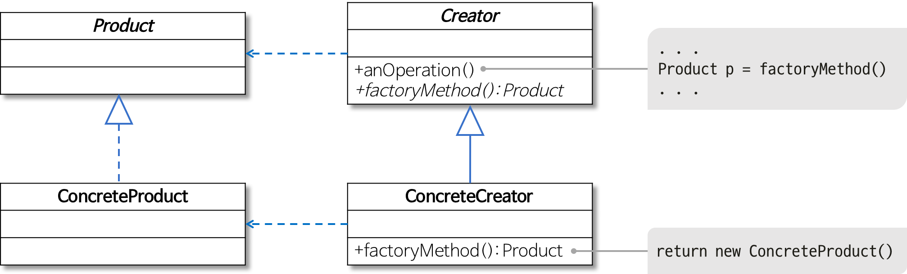
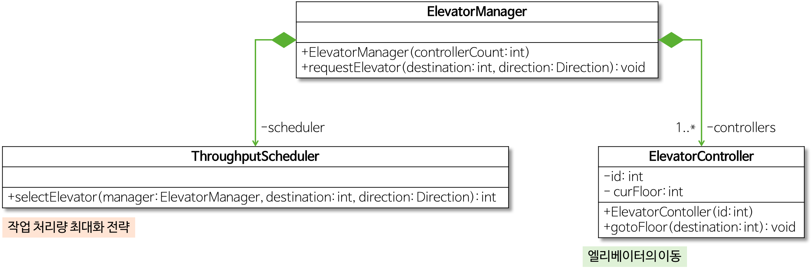
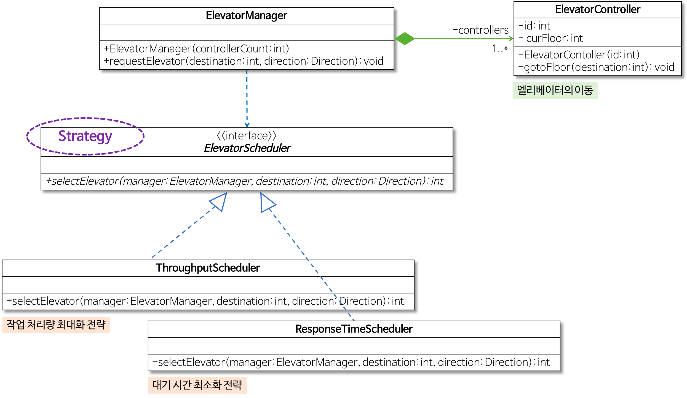
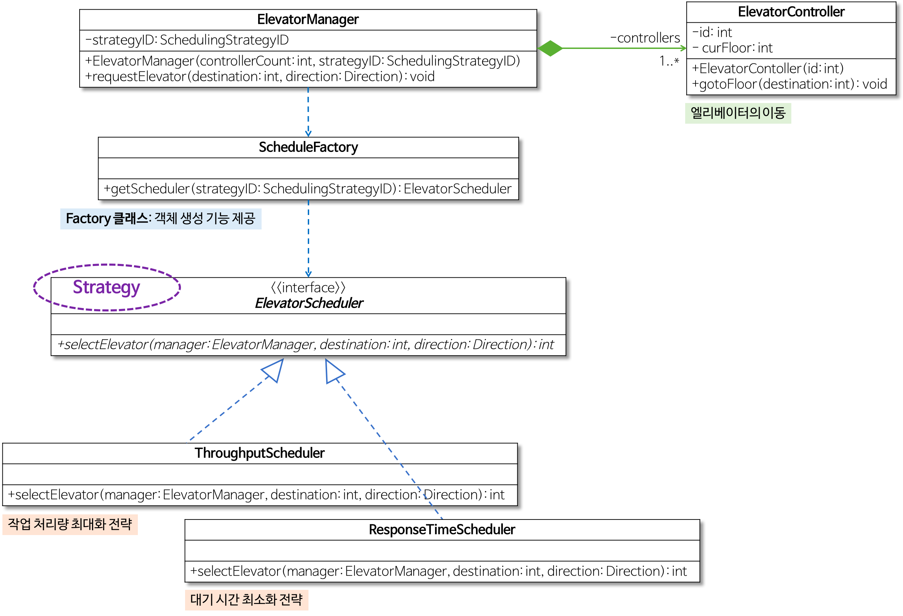
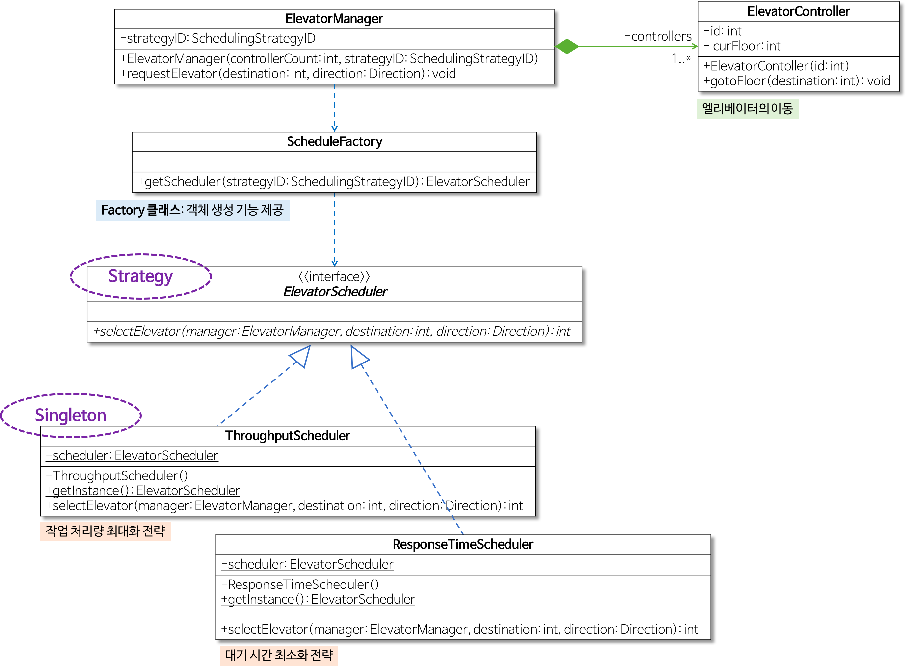
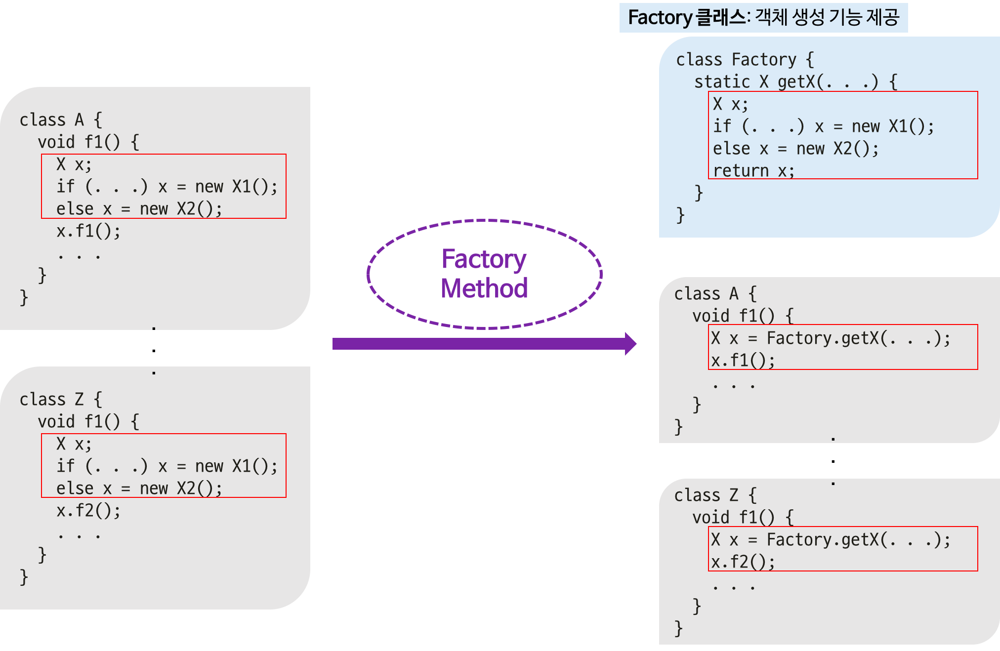
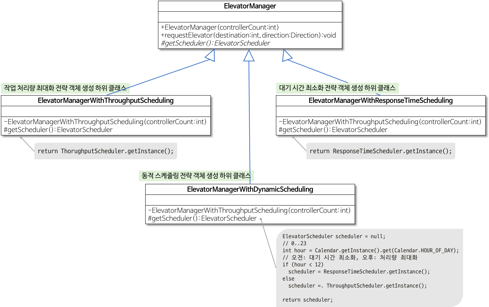
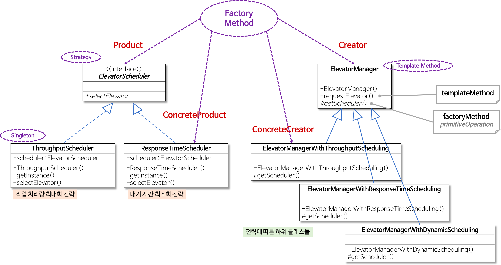

# Factory Method Pattern

[팩토리 메소드 패턴 (Factory Method Pattern)](https://johngrib.github.io/wiki/factory-method-pattern/)

[팩토리 메소드 패턴(Factory Method Pattern)
](https://jdm.kr/blog/180)

[[Design Pattern] 팩토리 메서드 패턴이란](https://gmlwjd9405.github.io/2018/08/07/factory-method-pattern.html)

> 객체를 생성하기 위한 인터페이스를 정의하고, 인스턴스 생성은 서브클래스가 결정하게 한다.

팩토리 메소드 패턴(Factory Method Pattern), 가상 생성자 패턴(Virtual Constructor Pattern)으로 불린다.

## 의도
GoF는 다음과 같이 팩토리 메소드 패턴의 의도를 밝힌다.

> 객체를 생성하기 위해 인터페이스를 정의하지만, 어떤 클래스의 인스턴스를 생성할지에 대한 결정은 서브클래스가 내리도록 합니다.

## 요약
- 객체 생성을 캡슐화하는 패턴이다.
- `Creator`의 서브클래스에 팩토리 메소드를 정의하여 팩토리 메소드 호출로 적절한 `ConcreteProduct` 인스턴스를 반환하게 한다.

## 구현시 고려할 점들
- 팩토리 메소드 패턴의 구현 방법은 크게 두 가지가 있다.
    - `Creator`를 추상 클래스로 정의하고, 팩토리 메소드는 `abstract`로 선언하는 방법
    - `Creator`가 구체 클래스이고, 팩토리 메소드의 기본 구현을 제공하는 방법
- 팩토리 메소드의 인자를 통해 다양한 `Product`를 생성하게 한다.
    - 팩토리 메소드에 잘못된 인자가 들어올 경우의 런타임 에러 처리에 대해 고민할 것
    - Enum 등을 사용하는 것도 고려할 필요가 있다.

## 예제
- Java 언어로 배우는 디자인 패턴 입문의 예제 (생략)
- 헤드 퍼스트 디자인 패턴의 예제 (생략)

## 인용
Allen Holub은 "실용주의 디자인 패턴"에서 이 패턴에 대해 다음과 같이 언급했다.

> Factory Method 패턴은 기반 클래스에 알려지지 않은 구체 클래스를 생성하는 Template Method라 할 수 있다. Factory Method의 반환 타입은 생성되어 반환되는 객체가 구현하고 있는 인터페이스이다. Factory Method는 또한 기반 클래스 코드에 구체 클래스의 이름을 감추는 방법이기도 하다(Factory Method는 부적절한 이름이다. 사람들은 객체를 생성하는 모든 메소드를 자연스레 팩토리 메소드라 부르는 경향이 있는데, 이러한 생성 메소드가 모두 Factory Method 패턴을 사용하는 것은 아니다).

---

기본적으로 팩토리는 공장이란 뜻을 내포하고 있습니다. 따라서 팩토리 메소드 패턴도 무언가를 위한 공장이라고 보면 됩니다. 일반적으로 팩토리 메소드 패턴은 다음처럼 말할 수 있습니다.

>객체를 만들어내는 부분을 서브 클래스Sub-Class에 위임하는 패턴.

즉, `new` 키워드를 호출하는 부분을 서브 클래스에 위임하는 겁니다. 결국 팩토리 메소드 패턴은 객체를 만들어내는 공장(Factory 객체)을 만드는 패턴이라 이해하면 됩니다.

메인프로그램에 `new` 키워드가 없는 것이 객체 생성을 팩토리 클래스에 위임한 결과다. 또한 메인 프로그램은 어떤 객체가 생성되었는지는 신경쓰지 않고 반환된 객체를 사용하기만 하면 된다. 또한 새로운 제품이 추가되고 새로운 팩토리가 추가된다고 하더라도 메인프로그램에서 변경할 코드는 최소화된다.

## 요약
팩토리 메소드 패턴을 사용하는 이유는 클래스간의 결합도를 낮추기 위한것입니다. 결합도라는 것은 간단히 말해 클래스의 변경점이 생겼을 때 얼마나 다른 클래스에도 영향을 주는가입니다. 팩토리 메소드 패턴을 사용하는 경우 직접 객체를 생성해 사용하는 것을 방지하고 서브 클래스에 위임함으로써 보다 효율적인 코드 제어를 할 수 있고 의존성을 제거합니다. 결과적으로 결합도 또한 낮출 수 있습니다.

---

## 팩토리 메서드 패턴이란

- **객체 생성 처리를 서브 클래스로 분리**해 처리하도록 캡슐화하는 패턴
  - 즉, 객체의 생성 코드를 별도의 클래스/메서드로 분리함으로써 객체 생성의 변화에 대비하는 데 유용하다.
  - 특정 기능의 구현은 개별 클래스를 통해 제공되는 것이 바람직한 설계다.
    - 기능의 변경이나 상황에 따른 기능의 선택은 해당 객체를 생성하는 코드의 변경을 초래한다. 
    - 상황에 따라 적절한 객체를 생성하는 코드는 자주 중복될 수 있다. 
    - 객체 생성 방식의 변화는 해당되는 모든 코드 부분을 변경해야 하는 문제가 발생한다. 
    - **스트래티지 패턴, 싱글턴 패턴, 템플릿 메서드 패턴**을 사용한다.
    - ‘생성(Creational) 패턴’의 하나 (아래 참고)

- 역할이 수행하는 작업
  - Product
    - 팩토리 메서드로 생성될 객체의 공통 인터페이스
  - ConcreteProduct
    - 구체적으로 객체가 생성되는 클래스
  - Creator
    - 팩토리 메서드를 갖는 클래스
  - ConcreteCreator
    - 팩토리 메서드를 구현하는 클래스로, ConcreteProduct 객체를 생성

- 팩토리 메서드 패턴의 개념과 적용 방법
  1. 객체 생성을 전담하는 별도의 Factory 클래스 사용
     - 스트래티지 패턴과 싱글턴 패턴을 이용한다.
  2. 상속 이용: 하위 클래스에서 적합한 클래스와 객체를 생성
     - 스트래티지 패턴, 싱글턴 패턴과 템플릿 메서드 패턴을 이용한다.

- 참고
  - 생성(Creational) 패턴
    - 객체 생성에 관련된 패턴
    - 객체의 생성과 조합을 캠슐화해 특정 객체가 생성되거나 변경되어도 프로그램 구조에 영향을 크게 받지 않도록 유연성을 제공한다.
  
## 예시 - 여러 가지 방식의 엘리베이터 스케줄링 방법 지원하기

- 작업 처리량(Throughput)을 기준으로 한 스케줄링에 따른 엘리베이터 관리
- 스케줄링: 주어진 요청(목적지 층,방향)을 받았을 때 여러 대의 엘리베이터 중 하나를 선택하는 것을 말한다.
  - 예를 들어 엘리베이터 내부에서 버튼(ElevatorButton)을 눌렀을 때는 해당 사용자가 탄 엘리베이터를 이동시킨다. 그러나 사용자가 엘리베이터 외부, 즉 건물 내부의 층에서 버튼(FloorButton)을 누른 경우에는 여러 대의 엘리베이터 중 하나를 선택해 이동시켜야 한다.

### 문제점 1
1. **다른 스케줄링 전략**을 사용하는 경우
    - 엘리베이터 작업 처리량을 최대화(ThroughputScheduler 클래스)시키는 전략이 아닌 사용자의 대기 시간을 최소화하는 엘리베이터 선택 전략을 사용해야 한다면?
2. 프로그램 실행 중에 스케줄링 전략을 변경, 즉 **동적 스케줄링을 지원**해야하는 경우
    - 오전에는 대기 시간 최소화 전략을 사용하고, 오후에는 처리량 최대화 전략을 사용해야 한다면?

### 해결 1

- `requestElevator()` 메서드가 실행될 때마다 현재 시간에 따라 적절한 스케줄링 객체를 생성해야 한다.
- `ElevatorManager` 클래스의 입장에서는 여러 스케줄링 전략이 있기 때문에 `ElevatorScheduler`라는 인터페이스를 사용하여 여러 전략들을 캡슐화하여 동적으로 선택할 수 있게 한다.

### 문제점 2
- 엘리베이터 스케줄링 전략이 추가되거나 동적 스케줄링 방식으로 전략을 선택하도록 변경되면
  1. 해당 스케줄링 전략을 지원하는 구체적인 클래스를 생성해야 한다.
  2. `ElevatorManager` 클래스의 `requestElevator()` 메서드도 수정할 수밖에 없다.
    - `requestElevator()` 메서드의 책임: 엘리베이터 선택, 엘리베이터 이동
    - 즉, 엘리베이터를 선택하는 전략의 변경에 따라 `requestElevator()` 메서드가 변경되는 것은 바람직하지 않다.

- 문제 상황 예시: 새로운 스케줄링 전략이 추가되는 경우, 동적 스케줄링 방식이 변경되는 경우

### 해결 2

1. 주어진 기능을 실제로 제공하는 적절한 **클래스 생성 작업을 별도의 클래스/메서드로 분리**시켜야 한다.

    
   
    - 엘리베이터 스케줄링 전략에 일치하는 클래스를 생성하는 코드를 `requestElevator` 메서드에서 분리해 별도의 클래스/메서드를 정의한다.
      - 변경 전: `ElevatorManager` 클래스가 직접 `ThroughputScheduler` 객체와 `ResponseTimeScheduler` 객체를 생성
      - 변경 후: `SchedulerFactory` 클래스의 `getScheduler()` 메서드가 스케줄링 전략에 맞는 객체를 생성
2. 동적 스케줄링 방식(DynamicScheduler)이라고 하면 여러 번 스케줄링 객체를 생성하지 않고 **한 번 생성한 것을 계속해서 사용하는 것이 바람직**할 수 있다.

    싱글턴 패턴을 활용한 엘리베이터 스케줄링 전략 설계
   
    

   - 스케줄링 기능을 제공하는 `ResponseTimeScheduler` 클래스와 `ThroughputScheduler` 클래스는 오직 하나의 객체만 생성해서 사용하도록 한다.
   - 즉, 생성자를 통해 직접 객체를 생성하는 것이 허용되지 않아야 한다.
        - 이를 위해 각 생성자를 `private`으로 정의한다.
        - 대신 `getInstance()` 라는 정적 메서드로 객체 생성을 구현한다.
    

다음과 같이 객체 생성을 전담하는 별도의 Factory 클래스를 분리하여 객체 생성의 변화에 대비할 수 있다.

이 방법은 스트래티지 패턴과 싱글턴 패턴을 이용하여 팩토리 메서드 패턴을 적용한다.

### 팩토리 메서드 패턴 Way 2
1. Factory 클래스 이용
    - `SchedulerFactory` 클래스에서 3가지 방식(최대 처리량, 최소 대기 시간, 동적 선택)에 맞춰 `ThroughputScheduler` 객체나 `ResponseTimeScheduler` 객체를 생성
2. 상속 이용
    - 해당 스케줄링 전략에 따라 엘리베이터를 선택하는 클래스를 `ElevatorManager` 클래스의 하위 클래스로 정의
    - 하위 클래스에서 적합한 클래스의 객체를 생성하여 객체의 생성 코드를 분리한다.
    - 이 방법은 스트래티지 패턴, 싱글턴 패턴, 템플릿 메서드 패턴을 이용하여 팩토리 메서드 패턴을 적용한다.

    

- 팩토리 메서드
    - `ElevatorManager` 클래스의 `getScheduler()` 메서드
    - 스케줄링 전략 객체를 생성하는 기능 제공 (즉, 객체 생성을 분리)
    - 참고) 템플릿 메서드 패턴의 개념에 따르면, 하위 클래스에서 오버라이드될 필요가 있는 메서드는 primitive 또는 hook 메서드라고도 부른다.

- 템플릿 메서드
    - `ElevatorManager` 클래스의 `requestElevator()` 메서드
    - 공통 기능(스케줄링 전략 객체 생성, 엘리베이터 선택, 엘리베이터 이동)의 일반 로직 제공
    - 하위 클래스에서 구체적으로 정의할 필요가 있는 ‘스케줄링 전략 객체 생성’ 부분은 하위 클래스에서 오버라이드
    - 참고) 템플릿 메서드 패턴을 이용하면 전체적으로는 동일하면서 부분적으로는 다른 구문으로 구성된 메서드의 코드 중복을 최소화시킬 수 있다.

- 즉, 팩토리 메서드를 호출하는 상위 클래스의 메서드는 템플릿 메서드가 된다.

- `Product`: `ElevatorScheduler` 인터페이스 
- `ConcreteProduct`: `ThroughputScheduler` 클래스와 `ResponseTimeScheduler` 클래스
- `Creator`: `ElevatorManager` 클래스
- `ConcreteCreator`: `ElevatorManagerWithThroughputScheduling` 클래스, `ElevatorManagerWithResponseTimeScheduling` 클래스, `ElevatorManagerWithDynamicScheduling` 클래스
