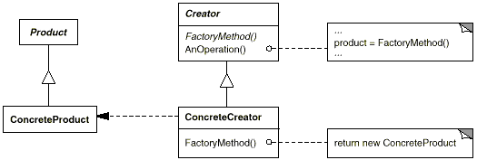

# Factory Method Pattern

[팩토리 메소드 패턴 (Factory Method Pattern)](https://johngrib.github.io/wiki/factory-method-pattern/)

[팩토리 메소드 패턴(Factory Method Pattern)
](https://jdm.kr/blog/180)

[[Design Pattern] 팩토리 메서드 패턴이란
heejeong Kwon 07 Aug 2018
](https://gmlwjd9405.github.io/2018/08/07/factory-method-pattern.html)

> 객체를 생성하기 위한 인터페이스를 정의하고, 인스턴스 생성은 서브클래스가 결정하게 한다.

팩토리 메소드 패턴(Factory Method Pattern), 가상 생성자 패턴(Virtual Constructor Pattern)으로 불린다.

## 의도
GoF는 다음과 같이 팩토리 메소드 패턴의 의도를 밝힌다.

> 객체를 생성하기 위해 인터페이스를 정의하지만, 어떤 클래스의 인스턴스를 생성할지에 대한 결정은 서브클래스가 내리도록 합니다.

## 요약
- 객체 생성을 캡슐화하는 패턴이다.
- `Creator`의 서브클래스에 팩토리 메소드를 정의하여 팩토리 메소드 호출로 적절한 `ConcreteProduct` 인스턴스를 반환하게 한다.

## 구현시 고려할 점들
- 팩토리 메소드 패턴의 구현 방법은 크게 두 가지가 있다.
    - `Creator`를 추상 클래스로 정의하고, 팩토리 메소드는 `abstract`로 선언하는 방법
    - `Creator`가 구체 클래스이고, 팩토리 메소드의 기본 구현을 제공하는 방법
- 팩토리 메소드의 인자를 통해 다양한 `Product`를 생성하게 한다.
    - 팩토리 메소드에 잘못된 인자가 들어올 경우의 런타임 에러 처리에 대해 고민할 것
    - Enum 등을 사용하는 것도 고려할 필요가 있다.

## 예제
- Java 언어로 배우는 디자인 패턴 입문의 예제 (생략)
- 헤드 퍼스트 디자인 패턴의 예제 (생략)

## 인용
Allen Holub은 "실용주의 디자인 패턴"에서 이 패턴에 대해 다음과 같이 언급했다.

> Factory Method 패턴은 기반 클래스에 알려지지 않은 구체 클래스를 생성하는 Template Method라 할 수 있다. Factory Method의 반환 타입은 생성되어 반환되는 객체가 구현하고 있는 인터페이스이다. Factory Method는 또한 기반 클래스 코드에 구체 클래스의 이름을 감추는 방법이기도 하다(Factory Method는 부적절한 이름이다. 사람들은 객체를 생성하는 모든 메소드를 자연스레 팩토리 메소드라 부르는 경향이 있는데, 이러한 생성 메소드가 모두 Factory Method 패턴을 사용하는 것은 아니다).

---

기본적으로 팩토리는 공장이란 뜻을 내포하고 있습니다. 따라서 팩토리 메소드 패턴도 무언가를 위한 공장이라고 보면 됩니다. 일반적으로 팩토리 메소드 패턴은 다음처럼 말할 수 있습니다.

>객체를 만들어내는 부분을 서브 클래스Sub-Class에 위임하는 패턴.

즉, `new` 키워드를 호출하는 부분을 서브 클래스에 위임하는 겁니다. 결국 팩토리 메소드 패턴은 객체를 만들어내는 공장(Factory 객체)을 만드는 패턴이라 이해하면 됩니다.

메인프로그램에 `new` 키워드가 없는 것이 객체 생성을 팩토리 클래스에 위임한 결과다. 또한 메인 프로그램은 어떤 객체가 생성되었는지는 신경쓰지 않고 반환된 객체를 사용하기만 하면 된다. 또한 새로운 제품이 추가되고 새로운 팩토리가 추가된다고 하더라도 메인프로그램에서 변경할 코드는 최소화된다.

## 요약
팩토리 메소드 패턴을 사용하는 이유는 클래스간의 결합도를 낮추기 위한것입니다. 결합도라는 것은 간단히 말해 클래스의 변경점이 생겼을 때 얼마나 다른 클래스에도 영향을 주는가입니다. 팩토리 메소드 패턴을 사용하는 경우 직접 객체를 생성해 사용하는 것을 방지하고 서브 클래스에 위임함으로써 보다 효율적인 코드 제어를 할 수 있고 의존성을 제거합니다. 결과적으로 결합도 또한 낮출 수 있습니다.