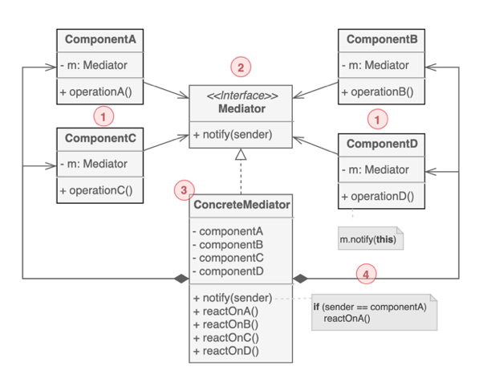

# Mediator Pattern

[[디자인패턴] Mediator Pattern (중재자 패턴)](https://ganghee-lee.tistory.com/8)

[Mediator 패턴](https://effectiveprogramming.tistory.com/entry/Mediator-%ED%8C%A8%ED%84%B4)

[[디자인 패턴] 중재자 패턴(Mediator Pattern)](https://always-intern.tistory.com/5)

[[디자인패턴] Mediator(중재자) : 복잡한 의존 관계와 로직은 캡슐화](https://joycestudios.tistory.com/44)

[중재자(Mediator) 패턴](https://programmingfbf7290.tistory.com/entry/%EC%A4%91%EC%9E%AC%EC%9E%90Mediator-%ED%8C%A8%ED%84%B4)

[[디자인 패턴] 12. 중재자 패턴 ( Mediator Pattern )](https://itchipmunk.tistory.com/372)

중재자 패턴


1. M개의 객체 사이에 N개의 관계가 형성되어 있어 아주 복잡하게 얽혀있을 때, 이를 M:1 관계로 바꾸기 위해 중재자 패턴을 사용한다.
2. M개의 객체 사이에 이들의 관계를 제어하는 중재자를 하나 넣어서 중재자가 모든 객체들의 커뮤니케이션을 관리하도록 한다.

- 객체들 사이에 중재자를 끼워넣어 연결관계를 캡슐화한다.
- 클래스들을 느슨한 결합 상태로 유지할 수 있다.
    - 서로 알 필요 없고 중재자가 모두 관리하므로
- 장점
    - 전체적인 연결관계를 이해하기 쉽다.
        - 커뮤니케이션의 흐름을 이햐하기 쉽다.
- 단점
    - 특정 애플리케이션 로직에 맞춰져있기 때문에 다른 애플리케이션에서 재사용하기 힘들다.
        - 옵저버 패턴의 경우 반대이다. 재사용성은 좋지만 연결관계가 복잡해지면 이해하기 어렵다.

## 목적
서로 상호작용하는 객체들을 캡슐화함으로써 느슨한 결합(loose coupling)을 유지하기 위함이다.

## 활용 상황
- 객체들 사이에 너무 많은 관계가 얽혀있을 때
- 객체들 사이에 상호작용 관계가 복잡할 때

## 예시


- `Font box`가 있을 때, `Font`에 따라 지원되는 `size`, `style` 등이 다르다. 따라서 각 객체들이 서로를 관찰하고 있어야한다.

- 따라서 다이어그램과 같이 `Font box`의 중재자인 `FontDialogDirector`가 복수개의 `Widget object`를 관리해줘야 한다.
  
  
- Client
- Director
- Widget Object
  
  
1. `List Box`가 `Director`에게 변화를 알린다.
2. `Director`가 `List Box`에서 어떤 것이 선택된건지 받아온다.
3. `Entry field`에 선택을 전달한다.
4. 이제 `Entry field`는 선택에 맞는 `style`을 제공한다.

## 미디에이터 패턴 vs 옵저버 패턴


- 미디에이터의 경우 M개의 퍼블리셔(publisher)와 N개의 서브스크라이버(subscriber)가 존재한다.
- 즉, M개의 퍼블리셔가 서로 상태를 관찰하기 때문에 퍼블리셔가 서브스크라이버가 될 수도, 서브스크라이버가 퍼블리셔가 될 수도 있다.
- 재사용성이 안좋다.


- 옵저버의 경우 1개의 퍼블리셔(publisher)에 대해 N개의 서브스크라이버(subscriber)가 존재한다.
- 즉, 복수의 서브스크라이버가 퍼블리셔의 상태만 관찰하는 셈이다.
- 재사용성이 좋다.

---

시스템을 설계하다보면 이벤트가 발생하는 객체가 여러개이며 이 이벤트를 받는 곳도 여러개인 경우가 있다. 이런 경우에 모든 이벤트를 주고 받기 위해서는 `M:N` 관계가 생긴다. 이렇게 되면 전체 시스템이 복잡해지는 것은 당연하다. 미디에이터 패턴은 이런 다대다 관계 사이에 중간 객체를 도입하여 각각 일대다 관계를 만들어주는 패턴이다.


==== ⬇️ ====


각 이벤트 소스는 모두 이벤트 수신자에게 이벤트를 보내주어야 한다. 이벤트 소스나 수신자의 개수가 1~2개 정도인 경우에는 큰 문제가 없겠지만, 그 개수가 늘어나면 위와 같이 복잡한 관계가 만들어진다. 이것은 모든 소스가 모든 수신자를 알고 있어야하고, 자신이 알고 있는 모든 수신자에게 이벤트를 전달하기 때문이다. 이를 단순화하기 위해서는 각 소스는 어떤 이벤트가 발생했다는 사실만 별도의 객체에 알려주고, 이벤트 수신자에게 이벤트를 보내는 역할은 그 객체가 담당하도록 하면 된다. 이것이 미디에이터 패턴이다.

이처럼 이벤트 소스와 이벤트 수신자 간의 복잡한 관계를 단순화시킬 수 있다.


---

## 개요

- 객체들 간의 상호작용 행위를 정리하여 모은 중재자 객체를 따로 두어 관리하는 디자인 패턴

- 중재자 패턴이 사용되는 경우
    - 객체들간의 관계가 매우 복잡하여 객체의 재사용이 어려울 경우

- 장점
    - 관계를 가지고있는 객체를 직접 수정하지 않고도 관계를 수정할 수 있습니다.
    - 객체들 간의 관계 복잡도, 의존성 및 결합도가 감소합니다.

- 단점
    - 중재자 패턴 사용 시 중재자 객체에 권한이 집중되어 굉장히 크고 복잡해지므로 설계 및 중재자 객체 수정 시 주의해야 합니다.

## UML

> Diagram


- `Mediator`
    - 객체 간의 상호작용을 위한 인터페이스를 정의함
- `ConcreteMediator`
    - 중개자의 인터페이스를 구현하여 객체간의 상호작용을 제어함
- `Colleague`
    - 다른 객체와의 상호작용을 위한 인터페이스를 정의함
- `ConcreteColleague`
    - 객체의 인터페이스를 구현하여 중개자를 통해 다른 객체와 상호작용함
  
---

- 복잡한 의존 관계를 줄이고자할 때 유용한 행동 디자인 패턴
- 모든 클래스 간의 복잡한 로직(상호작용)을 캡슐화하여 하나의 클래스에 위임하여 처리하는 패턴
- 비슷한 패턴으로 Facade 패턴과 Observer 패턴 등이 있음

- 결론: 커뮤니케이션 하고자 하는 객체가 있을 때 관계가 복잡한 경우 이를 해결하고 커플링(결합)을 약화시키는 패턴

## 구조

미디에이터 패턴을 UML로 도식화



- `Mediator`

    여러 Component를 중재하는 인터페이스를 가지고 있는 추상 클래스 객체

- `ConcreteMediator`
  
    여러 Component 객체를 가지고 있으면서 중재하는 역할을 하는 객체

- `Component`

    Mediator 객체에 의해 관리 및 중재를 받을 기본 클래스 객체

---

> 복붙

프로그램에서 상호작용을 해야 하는 객체들이 서로 복잡하게 관계를 맺고 있을 경우 상호작용에 관련된 행동을 별도 형식으로 정의하여 중재를 맡는 객체를 만드는 패턴이다.

ex) '갑'은 이사를 하고 싶어 집을 부동산에 내놓았다. 그러면 부동산 중개업자는 새로운 사람에게 해당 집을 대신해서 팔아준다. 그 과정에서 '갑'은 집을 사고 싶다는 사람과 어떠한 연관 관계를 갖지 않게 된다. 집을 사고 싶은 사람도 '갑'과 어떠한 관계를 맺지 않아도 된다. 이렇게 부동산 중개업자는 집을 파는 사람과 사는 사람들끼리 불편한 관계를 형성하지 않고 서로 원하는 이사라는 작업을 수행할 수 있게 해준다. 여기서 "커맨드 패턴" 포스트에 게시된 예제를 살펴보자.

```java
OpenMenuItem(String s, Frame frame){
   super(s);
   this.frame = frame;
}

public SaveMenuItem(String s, Frame frame){
   super(s);
   this.frame = frame;
}
```

위 코드를 보면 OpenMenuItem과 SaveMenuItem 객체는 Frame 클래스의 객체와 연관되어 있다. 이런 연관 관계는 연관된 클래스의 변화가 발생하면 관계된 다른 클래스의 변화를 가져오게 된다. 즉, 유지보수에 문제가 발생할수 밖에 없다. 또한 메뉴 아이템 클래스들은 메모장 프로젝트에서만 사용될 수 밖에 없는 이식성에 제한이 발생하게 된다. 객체지향 언어를 사용하는 이유 중 하나가 재사용성임에도 그렇게 할 수 없게 된다. 유지보수와 이식성에 문제를 일으키는 객체 간의 연관 관계 즉, 객체 간에 직접적인 메시지를 주고받음으로써 발생하는 문제를 해결하기 위해 이들 사이에 부동산 중개업자와 같은 매개체(Mediator)를 첨가해 해결할 수 있다.

MenuItem 컴포넌트들이 Mediator 클래스와 관계를 갖게끔 하고 UI 컴포넌트들 사이의 메시지 송수신은 Mediator 클래스 내에서 행해진다. 관련 클래스들이 Mediator 클래스 내에서만 연관 관계를 갖게 돼 클래스의 변화에 따른 소스 코드 수정은 Mediator 클래스 내부에 국한되므로 수정을 최소화 할 수 있다. 하지만 Mediator 클래스에 모든 것이 집중되므로 Mediator 클래스의 구현이 복잡해지고 GOD 클래스가 될 수 있는 문제를 내포하고 있다.

Command 패턴과 Mediator 패턴은 이들을 결합하여 응용할 수 있고 특히 GUI를 설계할 때 아주 유용하다. 단, Mediator 클래스를 잘못 구현하면 GOD 클래스가 될 수 있으므로 주의해야 한다.

---

> 복붙

```java
import java.awt.Font;
import java.awt.event.ActionEvent;
import java.awt.event.ActionListener;

import javax.swing.JButton;
import javax.swing.JFrame;
import javax.swing.JLabel;
import javax.swing.JPanel;

//Colleague interface
interface Command {
    void execute();
}

//Abstract Mediator
interface Mediator {
    void book();
    void view();
    void search();
    void registerView(BtnView v);
    void registerSearch(BtnSearch s);
    void registerBook(BtnBook b);
    void registerDisplay(LblDisplay d);
}

//Concrete mediator
class ParticipantMediator implements Mediator {

    BtnView btnView;
    BtnSearch btnSearch;
    BtnBook btnBook;
    LblDisplay show;

    //....
    public void registerView(BtnView v) {
        btnView = v;
    }

    public void registerSearch(BtnSearch s) {
        btnSearch = s;
    }

    public void registerBook(BtnBook b) {
        btnBook = b;
    }

    public void registerDisplay(LblDisplay d) {
        show = d;
    }

    public void book() {
        btnBook.setEnabled(false);
        btnView.setEnabled(true);
        btnSearch.setEnabled(true);
        show.setText("booking...");
    }

    public void view() {
        btnView.setEnabled(false);
        btnSearch.setEnabled(true);
        btnBook.setEnabled(true);
        show.setText("viewing...");
    }

    public void search() {
        btnSearch.setEnabled(false);
        btnView.setEnabled(true);
        btnBook.setEnabled(true);
        show.setText("searching...");
    }

}

//A concrete colleague
class BtnView extends JButton implements Command {

    Mediator med;

    BtnView(ActionListener al, Mediator m) {
        super("View");
        addActionListener(al);
        med = m;
        med.registerView(this);
    }

    public void execute() {
        med.view();
    }

}

//A concrete colleague
class BtnSearch extends JButton implements Command {

    Mediator med;

    BtnSearch(ActionListener al, Mediator m) {
        super("Search");
        addActionListener(al);
        med = m;
        med.registerSearch(this);
    }

    public void execute() {
        med.search();
    }

}

//A concrete colleague
class BtnBook extends JButton implements Command {

    Mediator med;

    BtnBook(ActionListener al, Mediator m) {
        super("Book");
        addActionListener(al);
        med = m;
        med.registerBook(this);
    }

    public void execute() {
        med.book();
    }

}

class LblDisplay extends JLabel {

    Mediator med;

    LblDisplay(Mediator m) {
        super("Just start...");
        med = m;
        med.registerDisplay(this);
        setFont(new Font("Arial", Font.BOLD, 24));
    }

}

class MediatorDemo extends JFrame implements ActionListener {

    Mediator med = new ParticipantMediator();

    MediatorDemo() {
        JPanel p = new JPanel();
        p.add(new BtnView(this, med));
        p.add(new BtnBook(this, med));
        p.add(new BtnSearch(this, med));
        getContentPane().add(new LblDisplay(med), "North");
        getContentPane().add(p, "South");
        setSize(400, 200);
        setVisible(true);
    }

    public void actionPerformed(ActionEvent ae) {
        Command comd = (Command) ae.getSource();
        comd.execute();
    }

    public static void main(String[] args) {
        new MediatorDemo();
    }

}
```