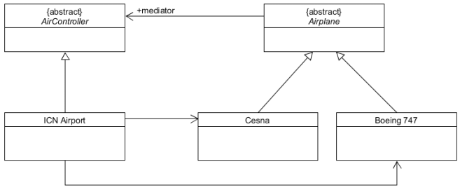
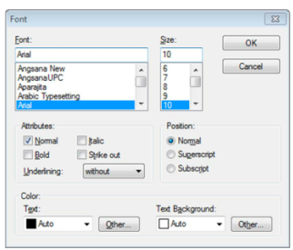
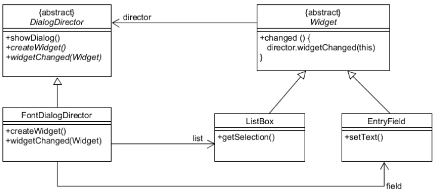
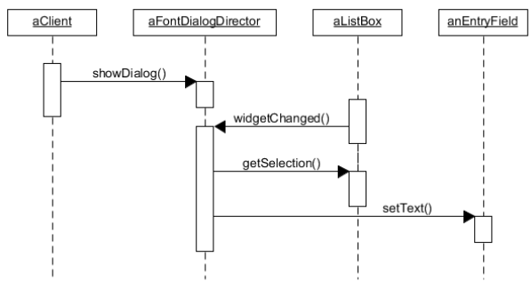
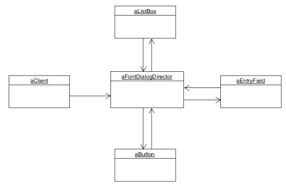
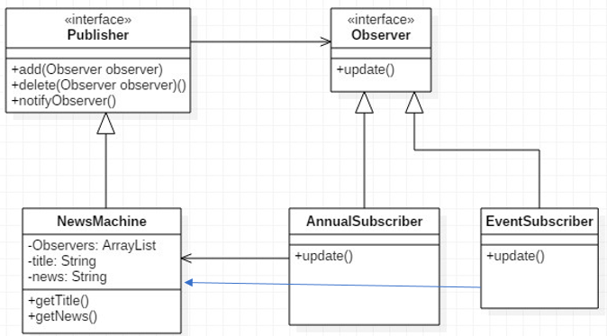
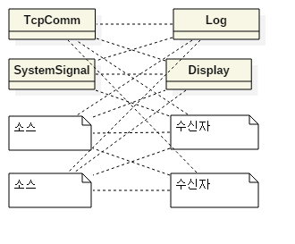
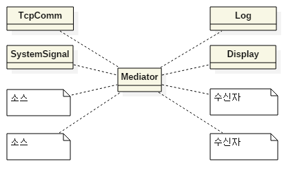
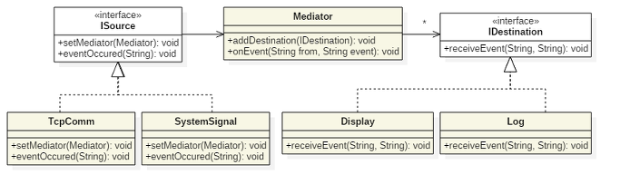
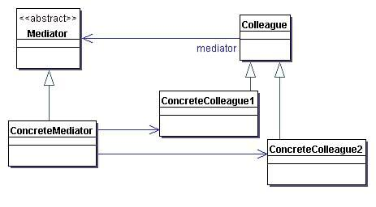

# Mediator Pattern

[[디자인패턴] Mediator Pattern (중재자 패턴)](https://ganghee-lee.tistory.com/8)

[Mediator 패턴](https://effectiveprogramming.tistory.com/entry/Mediator-%ED%8C%A8%ED%84%B4)

[[디자인 패턴] 중재자 패턴(Mediator Pattern)](https://always-intern.tistory.com/5)

중재자 패턴

1. M개의 객체 사이에 N개의 관계가 형성되어 있어 아주 복잡하게 얽혀있을 때, 이를 M:1 관계로 바꾸기 위해 중재자 패턴을 사용한다.
2. M개의 객체 사이에 이들의 관계를 제어하는 중재자를 하나 넣어서 중재자가 모든 객체들의 커뮤니케이션을 관리하도록 한다.

- 객체들 사이에 중재자를 끼워넣어 연결관계를 캡슐화한다.
- 클래스들을 느슨한 결합 상태로 유지할 수 있다.
    - 서로 알 필요 없고 중재자가 모두 관리하므로
- 장점
    - 전체적인 연결관계를 이해하기 쉽다.
        - 커뮤니케이션의 흐름을 이햐하기 쉽다.
- 단점
    - 특정 애플리케이션 로직에 맞춰져있기 때문에 다른 애플리케이션에서 재사용하기 힘들다.
        - 옵저버 패턴의 경우 반대이다. 재사용성은 좋지만 연결관계가 복잡해지면 이해하기 어렵다.

## 목적
서로 상호작용하는 객체들을 캡슐화함으로써 느슨한 결합(loose coupling)을 유지하기 위함이다.

## 활용 상황
- 객체들 사이에 너무 많은 관계가 얽혀있을 때
- 객체들 사이에 상호작용 관계가 복잡할 때

## 예시

- `Font box`가 있을 때, `Font`에 따라 지원되는 `size`, `style` 등이 다르다. 따라서 각 객체들이 서로를 관찰하고 있어야한다.

- 따라서 다이어그램과 같이 `Font box`의 중재자인 `FontDialogDirector`가 복수개의 `Widget object`를 관리해줘야 한다.
  
  
- Client
- Director
- Widget Object
  
  
1. `List Box`가 `Director`에게 변화를 알린다.
2. `Director`가 `List Box`에서 어떤 것이 선택된건지 받아온다.
3. `Entry field`에 선택을 전달한다.
4. 이제 `Entry field`는 선택에 맞는 `style`을 제공한다.

## 미디에이터 패턴 vs 옵저버 패턴

- 미디에이터의 경우 M개의 퍼블리셔(publisher)와 N개의 서브스크라이버(subscriber)가 존재한다.
- 즉, M개의 퍼블리셔가 서로 상태를 관찰하기 때문에 퍼블리셔가 서브스크라이버가 될 수도, 서브스크라이버가 퍼블리셔가 될 수도 있다.
- 재사용성이 안좋다.

- 옵저버의 경우 1개의 퍼블리셔(publisher)에 대해 N개의 서브스크라이버(subscriber)가 존재한다.
- 즉, 복수의 서브스크라이버가 퍼블리셔의 상태만 관찰하는 셈이다.
- 재사용성이 좋다.

---

시스템을 설계하다보면 이벤트가 발생하는 객체가 여러개이며 이 이벤트를 받는 곳도 여러개인 경우가 있다. 이런 경우에 모든 이벤트를 주고 받기 위해서는 `M:N` 관계가 생긴다. 이렇게 되면 전체 시스템이 복잡해지는 것은 당연하다. 미디에이터 패턴은 이런 다대다 관계 사이에 중간 객체를 도입하여 각각 일대다 관계를 만들어주는 패턴이다.

==== ⬇️ ====

각 이벤트 소스는 모두 이벤트 수신자에게 이벤트를 보내주어야 한다. 이벤트 소스나 수신자의 개수가 1~2개 정도인 경우에는 큰 문제가 없겠지만, 그 개수가 늘어나면 위와 같이 복잡한 관계가 만들어진다. 이것은 모든 소스가 모든 수신자를 알고 있어야하고, 자신이 알고 있는 모든 수신자에게 이벤트를 전달하기 때문이다. 이를 단순화하기 위해서는 각 소스는 어떤 이벤트가 발생했다는 사실만 별도의 객체에 알려주고, 이벤트 수신자에게 이벤트를 보내는 역할은 그 객체가 담당하도록 하면 된다. 이것이 미디에이터 패턴이다.

이처럼 이벤트 소스와 이벤트 수신자 간의 복잡한 관계를 단순화시킬 수 있다.

---

## 개요

- 객체들 간의 상호작용 행위를 정리하여 모은 중재자 객체를 따로 두어 관리하는 디자인 패턴

- 중재자 패턴이 사용되는 경우
    - 객체들간의 관계가 매우 복잡하여 객체의 재사용이 어려울 경우

- 장점
    - 관계를 가지고있는 객체를 직접 수정하지 않고도 관계를 수정할 수 있습니다.
    - 객체들 간의 관계 복잡도, 의존성 및 결합도가 감소합니다.

- 단점
    - 중재자 패턴 사용 시 중재자 객체에 권한이 집중되어 굉장히 크고 복잡해지므로 설계 및 중재자 객체 수정 시 주의해야 합니다.

## UML

> Diagram

- `Mediator`
    - 객체 간의 상호작용을 위한 인터페이스를 정의함
- `ConcreteMediator`
    - 중개자의 인터페이스를 구현하여 객체간의 상호작용을 제어함
- `Colleague`
    - 다른 객체와의 상호작용을 위한 인터페이스를 정의함
- `ConcreteColleague`
    - 객체의 인터페이스를 구현하여 중개자를 통해 다른 객체와 상호작용함