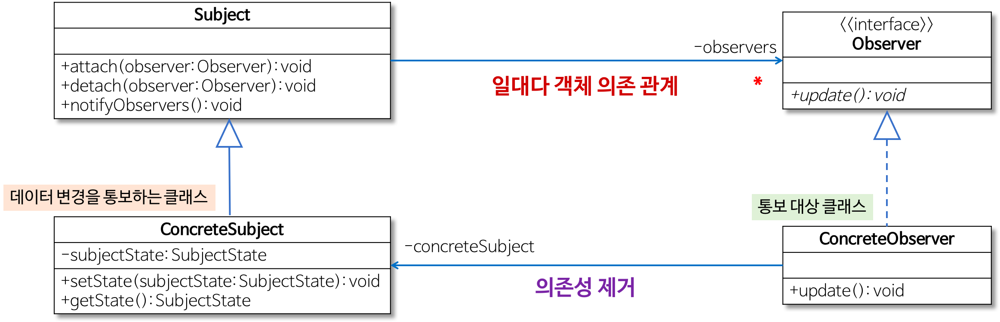
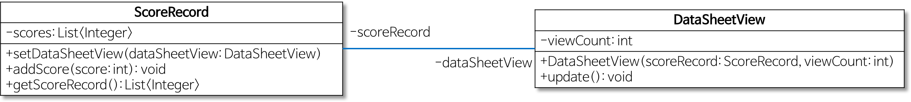
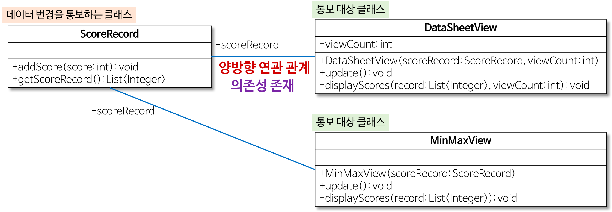
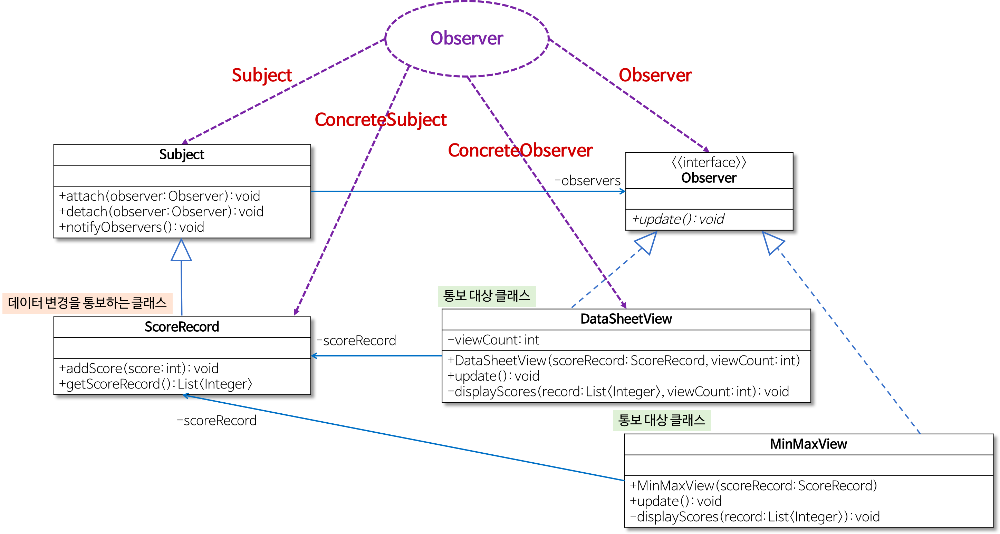
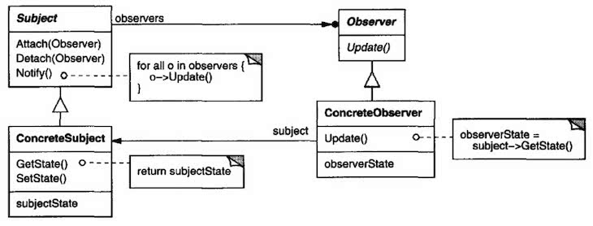

# Observer Pattern

옵저버 패턴

[[Design Pattern] 옵저버 패턴이란](https://gmlwjd9405.github.io/2018/07/08/observer-pattern.html)

[옵저버 패턴(Observer Pattern)](https://jdm.kr/blog/32)

[옵저버 패턴(Observer Pattern)](https://johngrib.github.io/wiki/observer-pattern/)

- 한 객체의 상태 변화에 따라 다른 객체의 상태도 연동되도록 **일대다 객체 의존 관계**를 구성하는 패턴
    - 데이터의 변경이 발생했을 경우 **상대 클래스나 객체에 의존하지 않으면서 데이터 변경을 통보**하고자 할 때 유용함
    - ex 1) 새로운 파일을 추가하거나 기존 파일을 삭제했을 때 탐색기는 다른 탐색기에게 즉시 변경을 통보해야 함
    - ex 2) 차량 연료량 클래스는 연료량이 부족한 경우 연료량을 알아야하는 구체적인 클래스(연료량 부족 경고 클래스, 주행 가능 거리 출력 클래스)에 직접 의존하지 않는 방식으로 연료량 변화를 통보해야 함
- 행위(Behavioral) 패턴 중 하나

    
- 옵저버 패턴은 통보 대상 객체의 관리를 `Subject` 클래스와 `Observer` 인터페이스로 일반화함
    - 이를 통해 데이터 변경을 통보하는 클래스(`ConcreteSubject`)는 통보 대상 클래스나 객체(`ConcreteObserver`)에 대한 의존성을 없앨 수 있음
    - 결과적으로 통보 대상 클래스나 객체(`ConcreteObserver`)의 변경에도 **통보하는 클래스(`ConcreteSubject`)를 수정 없이 그대로 사용할 수 있음**
- 역할
    - `Observer`
        - 데이터 변경을 통보받는 인터페이스
        - `Subject`에서는 `Observer` 인터페이스의 `update` 메서드를 호출함으로써 `ConcreteSubject`의 데이터 변경을 `ConcreteObserver`에게 통보함
    - `Subject`
        - `ConcreteObserver` 객체를 관리하는 요소
        - `Observer` 인터페이스를 참조해서 `ConcreteObserver`를 관리하므로 `ConcreteObserver`의 변화에 독립적인 것이 가능함
    - `ConcreteSubject`
        - 변경 관리 대상이 되는 데이터가 있는 클래스(= 통보하는 클래스)
        - 데이터 변경을 위한 메서드 `setState`가 있으며, 이 메서드에서는 자신의 데이터인 `subjectState`를 변경하고 `Subject`의 `notifyObservers` 메서드를 호출해서 `ConcreteObserver` 객체에 변경을 통보함
    - `ConcreteObserver`
        - `ConcreteSubject`의 변경을 통보받는 클래스
        - `Observer` 인터페이스의 `update` 메서드를 구현함으로써 변경을 통보받음
        - 변경된 데이터는 `ConcreteSubject`의 `getState` 메서드를 호출함으로써 변경을 조회함

- 행위(Behavioral) 패턴
    - 객체나 클래스 사이의 알고리즘이나 책임 분배에 관련된 패턴
    - 한 객체가 혼자 수행할 수 없는 작업을 여러 객체로 어떻게 분배하는지, 또 그렇게 하면서도 객체 사이의 결합도를 최소화하는 것에 중점을 둔다.
    
## 예시 - 여러가지 방식으로 성적 출력하기



### 문제점
1. 성적을 다른 형태로 출력하는 경우
    
    성적을 목록으로 출력하지 않고 성적의 최소/최대 값만 출력하려면?
   
    점수 변경에 대한 통보 대상 클래스가 다른 대상 클래스(DataSheetView -> MinMaxView)로 바뀌면 기존 ScoreRecord 클래스의 내용을 수정(DataSheetView 대신 MinMaxView 저장)해야 하므로 OCP에 위배된다.
2. 동시 혹은 순차적으로 성적을 출력하는 경우
    
    성적이 입력되었을 때 최대 3개 목록, 최대 5개 목록, 최소/최대 값을 동시에 출력하려면?
   
    처음에는 목록으로 출력하고 나중에는 최소/최대 값을 출력하려면?
   
    점수 변경에 대한 통보 대상 클래스가 다른 대상 클래스(DataSheetView -> MinMaxView)로 바뀌면 기존 ScoreRecord 클래스의 내용을 수정(DataSheetView와 MinMaxView 저장)해야 하므로 OCP에 위배된다.



### 해결

문제를 해결하기 위해서는 **공통 기능을 상위 클래스 및 인터페이스로 일반화**하고 이를 활용하여 통보하는 클래스(ScoreRecord 클래스)를 구현해야 한다.

- 즉, ScoreRecord 클래스에서 변화하는 부분을 식별하고 이를 일반화시켜야 한다.
    - 이를 통해 성적 통보 대상이 변경되더라도 ScoreRecord 클래스를 그대로 재사용할 수 있다.
- ScoreRecord 클래스에서 하는 작업
    - 통보 대상인 객체를 참조하는 것을 관리(추가/제거) -> `Subject` 추상클래스로 일반화
    - 각 통보 대상인 객체의 update 메서드 호출(addScore 메서드) -> `Observer` 인터페이스로 일반화
    




- `Observer`
  - 추상화된 통보 대상
- `DataSheetView`, `MinMaxView`
  - `Observer`를 `implements` 함으로써 구체적인 통보대상이 됨
- `Subject`
  - 성적 변경에 관심이 있는 대상 객체들을 관리
- `ScoreRecord`
  - `Subject`를 `extends` 함으로써 구체적인 통보 대상을 직접 참조하지 않아도 됨
    
---

> 상태 변화를 감시자에게 통지한다

옵저버 패턴(observer pattern)은 종속자 패턴(dependent pattern), 게시-구독 패턴(publish-subscribe pattern)이라고도 불린다.

## 의도

GoF 책에서 밝힌 옵저버 패턴의 의도

> 객체 사이에 일 대 다의 의존 관계를 정의해 두어, 어떤 객체의 상태가 변할 때 그 객체에 의존성을 가진 다른 객체들이 그 변화를 통지받고 자동으로 갱신될 수 있게 만듭니다.

## 구조



## 요약

- 구조
    - 구조 다이어그램에서 `Subject`를 잘 살펴보면 어렵지 않게 이해할 수 있다.
        - `Subject`에 여러 `Observer`를 등록(Attach)해 두고, `Notify`를 하게 되면 루프를 돌면서 각 `Observer`를 `Update`하는 패턴이다.
    - `Subject`와 `Observer`가 느슨한 결합을 갖는 것이 중요하다.
        - `Observer` 등록 순서 등에 특정 로직이 의존하지 않도록 한다.
    - 생각해보면 옵저버 패턴이라는 이름이 좀 미묘하다는 것을 알 수 있다. 스스로 감시하다가 변화를 알아차리는 것이 아니라, 변화를 통지받고 알게 되기 때문이다. 그래서 게시-구독 패턴이라는 별명도 있다.
- 참여자
    - `Observer`는 `Subject`에 생긴 변화에 관심을 갖는다.
    - Java 코드로 표현
        - `Observer` 인터페이스
            ```java
            public interface Observer {
                public void update(Subject theChangedSubject);
            }
            ```
          
            - `Subject`는 `Observer`들을 알고 있는 객체이며, 여러 `Observer`가 `Subject`에 붙을 수 있다.
            - `ConcreteSubject`는 다음과 같은 일을 한다.
                - `ConcreteObserver`에게 알려줘야 하는 상태를 저장한다.
                - 자신의 상태가 달라지면 `ConcreteObserver`에게 알려준다.
        - `Subject` 인터페이스
            ```java
            public interface Subject {
                public void attach(Observer o);
                public void detach(Observer o);
                public void notify(); 
            }
            ```
          
            - `attach`: `Subject`에 `Observer`를 구독자로 등록하는 메소드
            - `detach`: `Subject`에 구독자로 등록된 `Observer`의 구독을 해지시키는 메소드
            - `notify`: `Subject`에 구독자로 등록된 모든 `Observer`에 정보를 전달하는 메소드
- 예제
    - 블로그 주인분 예제
    
        ```java
        interface Observer {
            public void update(Subject s);
        }
        
        class ObserverImpl implements Observer {
            private Data data1;
            private Data data2;
        
            // update 함수에 주목
            public void update(Subject s) {
                this.data1 = s.getData1();
                this.data2 = s.getData2();
            }
        }
        ```

    - GoF 예제와의 차이점
        - GoF 예제에서는 `Observer`의 소멸자가 호출될 때 `detach`가 호출돼서 소멸되는 `Obvserver`가 알아서 `detach`됨
        - Java에서도 소멸자를 사용할 수는 있지만 권장되지 않으므로 생략함
        - `update`에 주어지는 `Subject`의 레퍼런스 검사를 생략함

        ```java
        interface Subject {
            public void attach(Observer o);
            public void detach(Observer o);
            public void notify();
        }
        
        class SubjectImpl implements Subject {
            private List<Observer> observers = new ArrayList<>();
            private Data data1;
            private Data data2;
        
            public void attach(Observer o) {
                observers.add(o);
            }
            public void detach(Observer o) {
                observers.remove(o);
            }
            public void notify() {
                // 모든 옵저버를 순회하며 업데이트를 해준다.
                for (Observer o : observers) {
                    o.update(this);
                }
            }
            public void setData1(Data d) {
                this.data1 = d;
            }
            ...
        }
        ```

## 구현할 때 고려할 점들

- 옵저버는 상태를 갖지 않아도 된다.
    - 상태는 `Subject`의 담당이므로 `Subject`와 `Observer`의 일대다 관계가 성립한다.
    - 예제에서는 `Observer`가 `update`를 통해 값을 전달받고 저장하지만, 상태를 굳이 저장할 필요가 없는 경우에는 상태를 저장하지 않아도 된다.
- Notify를 누가 호출해야 할까?
    - GoF는 다음 두 가지 방법 중에서 선택하라고 한다.
        1. `Subject`에서 변경이 발생할 때, 변경을 저장하는 메소드가 `Notify()`를 호출하는 방법
        2. 사용자(`main` 등)가 적절한 시기에 `Notify()`를 호출하는 방법
    
    참고로 `Observer`를 `attach`할 때 관심사를 함께 등록하는 방법도 있다. 이 방법을 사용해 구현하면 `Observer`마다 다른 정보를 전달해주도록 할 수 있다.

    ```java
    void Subject::Attach(Observer*, Aspect& interest);
    ```

- Update 메소드의 인자
    GoF의 예제에 등장하는 `Update`메소드의 시그니처:
    
    ```java
    void update(Subject theChangedSubject)
    ```

    -> `Subject`를 넘겨주고 옵저버가 넘겨받은 `Subject`에서 필요한 값을 얻는 방법

    하지만 이것은 반드시 지켜야 하는 약속은 아니며, 상황에 따라 다른 인자를 함께 넘기거나 단순히 값을 전달하는 정도로 심플하게 구현하는 것도 방법이다.

    ```java
    void update(Subject theChangedSubject, int changedCount)
    ```

    ```java
  void update(int value1, int value2)
    ```

- Observer의 행위가 Subject에 영향을 주는 경우
    - 만약 Observer의 행위가 Subject에 영향을 주는 로직이 있다면, 무한루프가 발생할 수 있으므로 주의할 필요가 있다.
    
    1. Subject가 notify를 호출한다.
    2. Observer의 update가 호출된다.
    3. Observer::update 실행 도중 Subject에 영향을 준다.
    4. Goto1

  "Java 언어로 배우는 디자인 패턴 입문"에서는 이러한 상황을 회피하기 위해 Observer에 플래그 변수를 하나 추가하여 Observer가 현재 update 중인지 아닌지 상태를 기록하는 꼼수를 제안한다. 급할 경우에는 고려할 수 있을 것 같다.
    ```java
    boolean isUpdate;
    
    @Override
    public void update(Subject s) {
        if (!isUpdate) {
            return;
        }
        this.subject = s;
    }
    ```

## 예제

### 헤드퍼스트 예제

### Java Magazine 2016 November/December에 실린 예제

## 사용예시

- Smalltalk 언어의 Model/View/Controller(MVC) 사용자 인터페이스 프레임워크 
    - MVC의 Model이 Subject 역할
    - MVC의 View가 Observer 역할
- Java Swing 등의 GUI 프레임워크
- 다양한 버튼과 리스너들(Observer)
- 등등

- Java 내장 Observable, Observer는 왜 deprecated 되었을까?

  <https://johngrib.github.io/wiki/observer-pattern/#java-%EB%82%B4%EC%9E%A5-observable-observer%EB%8A%94-%EC%99%9C-deprecated-%EB%90%98%EC%97%88%EC%9D%84%EA%B9%8C>
