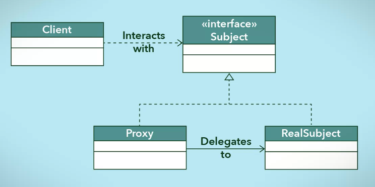
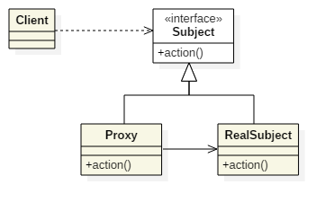
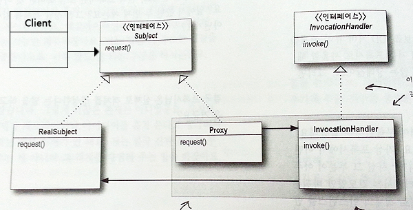
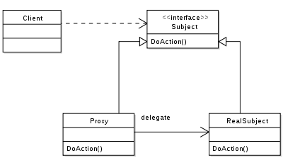
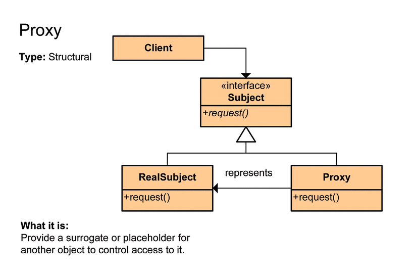
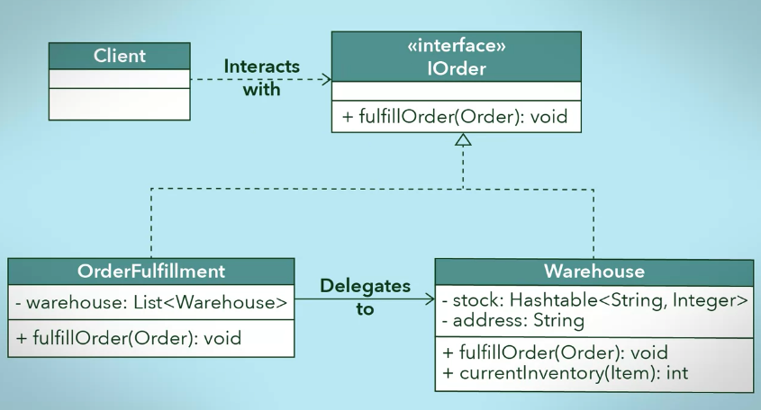

# Proxy Pattern

[프록시 패턴(Proxy Pattern)](https://jdm.kr/blog/235)

[프록시 패턴(proxy pattern) 이란?](https://developside.tistory.com/80)

[[디자인 패턴 9편] 구조 패턴, 프록시(Proxy)](https://dailyheumsi.tistory.com/201)

[[Design_Pattern] 프록시 패턴(Proxy Pattern)](https://limkydev.tistory.com/79)

[디자인패턴 - 프록시 패턴](https://yaboong.github.io/design-pattern/2018/10/17/proxy-pattern/)

## 정의
실제 기능을 수행하는 객체(Real Object) 대신 가상의 객체(Proxy Object)를 사용해 로직의 흐름을 제어하는 디자인 패턴

## 특징
- 원래 기능을 수행하며 그 외의 부가적인 작업(로깅, 인증, 네트워크 통신 등)을 수행하기에 좋다.
- 비용이 많이 드는 연산(DB 쿼리, 대용량 텍스트 파일 관련 처리 등)이 실제로 필요한 시점에 수행할 수 있다.
- 사용자 입장에서는 프록시 객체나 실제 객체나 사용법은 유사하므로 사용성이 좋다.

## 클래스 다이어그램



- Client는 Subject(interface)를 사용한다.
- Real Object, Proxy Object는 Subject(interface)를 구현한다.
- Proxy Object는 Real Object에 위임한다.
    - 프록시 객체는 메서드 수행 시 실제 객체의 메서드에 위임한다.

## 종류

프록시 패턴에서 사용할 수 있는 프록시의 종류는 다양하다.

## 가상 프록시(Virtual Proxy)

가상 프록시는 실제 객체의 사용 시점을 제어할 수 있습니다. 예를 들어 늦은 초기화(Lazy Initialization)를 프록시를 통해 구현해 봅시다.

아래처럼 텍스트 파일을 읽는 인터페이스가 있다고 가정합시다.

```java
interface TextFile {
    String fetch();
}
```

메서드가 하나밖에 없는 아주 간단한 인터페이스이며, 앞으로 이 인터펯이스를 구현하는 클래스는 반드시 `fetch()` 메서드를 구현해야 합니다.

이제부터 시나리오를 가정합시다.

> 보안 전자 서류 전문 업체에 근무하고 있는 개발자. 콘솔프로그램으로 난독화된 전자 서류의 본문을 20개씩 복호화해서 보여주는 프로그램을 작성할 것이다.

실제 업무를 수행하기에 앞서 협업 조직에서 `SecretTextFile`이라는 클래스를 인수 받았습니다.

```java
class SecretTextFile extends TextFile {
    private String plainText;
    
    public SecretTextFile(String fileName) {
        this.plainText = SecretFileHolder.decodeByFileName(fileName);
    }
    
    @Override
    public String fetch() {
        return plainText;
    }
}
```

```java
class SecretFileHolder { // 더미 메서드
    public static String decodeByFileName(String name) {
        try {
            Thread.sleep(300);
        } catch (InterruptedException e) {
            e.printStackTrace();
        }
        return name;
    }
}
```

`SecretTextFile` 클래스는 난독화 되어 있는 텍스트 파일을 복호화해서 평문으로 바꿔주는 클래스입니다. 협업 조직에서 라이브러리로 제공한 클래스라고 가정합시다. 즉, 저는 이 클래스를 수정할 권한은 없습니다.

이 클래스를 그대로 사용해서 콘솔 프로그램을 구성했습니다. 하지만 실행 시켜보고 첫 결과가 나오기까지 `6초`라는 시간이 걸리는 것을 알게 됩니다. `6초`는 제대로 프로그램이 동작하고는 있는지 의심하기에 충분한 시간입니다.

이유를 확인해보니 `SecretTextFile` 클래스에서 사용중인 `SecretFileHolder.decodeByFileName()` 메서드의 수행속도가 `0.3초`라는 것을 발견하게 됩니다. 그리고 목록에 20개의 파일 내용을 노출해야 하는 상태였기 때문에 문제가 된겁니다. 화면을 구성할 때 이 파일들을 전부 객체로 만들다 보니 `6초` 정도의 로딩 시간을 갖게 된것이죠.

문제를 확인했으니 코드 리팩토링을 하기로 결심합니다. 그래서 프록시 패턴을 적용해 필요할때만 파일 복호화를 하도록 수정하기로 했습니다. 다음의 클래스를 볼까요. 이제 프록시 클래스를 구현할 때입니다.

```java
class ProxyTextFile implements TextFile {
    private String fileName;
    private TextFile textFile;
    
    public ProxyTextFile(String fileName) {
        this.fileName = fileName;
    }
    
    @Override
    public String fetch() {
        if (textFile == null) {
            textFile = new SecretTextFile(fileName);
        }
        return "[proxy] " + textFile.fetch();
    }
}
```

```java
void main() {
    List<TextFile> textFileList = new ArrayList<>();
    textFileList.addAll(TextFileProvider.getSecretTextFile(0. 3));
    textFileList.addAll(TextFileProvider.getProxyTextFile(3, 20));
    textFileList.stream().map(TextFile::fetch).forEach(System.out::println);    
}
```

```java
class TextFileProvider {
    public static List<SecretTextFile> getSecretTextFile(int start, int end) {
        return IntStream.range(start, end)
                .mapToObj(i -> new SecretTextFile(String.valueOf(i)))
                .collect(Collectors.toList());
    }

    public static List<ProxyTextFile> getProxyTextFile(int start, int end) {
        return IntStream.range(start, end)
                .mapToObj(i -> new ProxyTextFile(String.valueOf(i)))
                .collect(Collectors.toList());
    }
}
```

`textFileList`를 사용하는 입장에서는 별다른 조치없이 그대로 사용하면 됩니다. 콘솔에서 `textFileList`를 순회하면서 노출한다고 하면 처음 세 개는 이미 로딩이 되어 있는 상태이므로 바로 노출하고 그 다음 아이템부터는 차근차근 노출할겁니다.

따라서 `ProxyTextFile` 같은 프록시 클래스를 만들고 기존 `SecretTextFile` 클래스 대신 사용한 것만으로도 초기 객체 생성 시간이 대폭 감소했습니다. 정말 필요한 시점에만 텍스트 복호화를 하게 되었죠. 이렇게 초기 비용이 많이 드는 연산이 포함된 객체의 경우 가상 프록시를 사용했을 때 효과를 볼 수 있습니다.

- Client
- Subject -> TextFile
- Proxy Object -> ProxyTextFile
- Real Objct -> SecretTextFile

## 보호 프록시(Protection Proxy)

보호 프록시는 프록시 객체가 사용자의 실제 객체에 대한 접근을 제어합니다.

새로운 시나리오입니다.

> 인사팀에서 인사정보에 대한 데이터 접근을 직책 단위로 세분화 하려고 합니다. 기존에는 오로지 인사팀에서만 사용했던 부분이었으나 최근 인사정보를 직책별로 공개해줘야 하는 경우가 생겼기 때문입니다. 따라서 전산팀에 근무중인 나는 직책에 따라서 조직원의 인사정보 접근을 제어하는 업무를 수행해야합니다.

```java
// 직책 등급(차례대로 조직원 staff, 조직장 manager, 부사장 vice president)
enum GRADE {
    Staff, Manager, VicePresident
}

// 구성원
interface Employee {
    String getName(); // 구성원의 이름
    GRADE getGrade(); // 구성원의 직책
    String getInformation(Employee viewer); // 구성원의 인사정보(매개변수는 조회자)
}

// 일반 구성원
class NormalEmployee implements Employee {
    private String name;
    private GRADE grade;

    public NormalEmployee(String name, GRADE grade) {
        this.name = name;
        this.grade = grade;
    }

    @Override
    public String getName() {
        return name;
    }

    @Override
    public GRADE getGrade() {
        return grade;
    }

    // 기본적으로 자신의 인사정보는 누구나 열람할 수 있도록 되어있습니다.
    @Override
    public String getInformation(Employee viewer) {
        return "Display " + getGrade().name() + " '" + getName() + "' personnel information.";
    }
}
```

이 상태로 놔두면 누구든지 `Employee` 객체에서 `getInformation()` 메서드를 호출하면 누가 조회하든 정보를 보여줄 것입니다. 이제부터 보호 프록시 클래스를 구성해봅시다. 이 클래스는 조회자의 직책을 확인하고 예외를 던지거나 인사 정보를 노출할 수 있도록 실제 객체에게 위임합니다.

```java
// 인사정보가 보호된 구성원(인사 정보 열람 권한 없으면 예외 발생)
class ProtectedEmployee implements Employee {
    private Employee employee;

    public ProtectedEmployee(Employee employee) {
        this.employee = employee;
    }

    @Override
    public String getInformation(Employee viewer) {
        // 본인 인사정보 조회
        if (this.employee.getGrade() == viewer.getGrade() && this.employee.getName().equals(viewer.getName())) {
            return this.employee.getInformation(viewer);
        }

        switch (viewer.getGrade()) {
            case VicePresident:
            	// 부사장은 조직장, 조직원들을 볼 수 있다.
                if (this.employee.getGrade() == GRADE.Manager || this.employee.getGrade() == GRADE.Staff) {
                    return this.employee.getInformation(viewer);
                }
            case Manager:
                if (this.employee.getGrade() == GRADE.Staff) { // 조직장은 조직원들을 볼 수 있다.
                    return this.employee.getInformation(viewer);
                }
            case Staff:
            default:
                throw new NotAuthorizedException(); // 조직원들은 다른 사람의 인사정보를 볼 수 없다.
        }
    }

    @Override
    public String getName() {
        return employee.getName();
    }

    @Override
    public GRADE getGrade() {
        return employee.getGrade();
    }
}

class NotAuthorizedException extends RuntimeException { // 보호 프록시에서 메서드 호출시 조회자에게 권한이 없으면 NotAuthorizedException 예외를 던진다.
    private static final long serialVersionUID = -1714144282967712658L;
}
```

```java
public void main() {
    // 직원별 개인 객체 생성
    Employee CTO = new NormalEmployee("Dragon Jung", GRADE.VicePresident);
    Employee CFO = new NormalEmployee("Money Lee", GRADE.VicePresident);
    Employee devManager = new NormalEmployee("Cats Chang", GRADE.Manager);
    Employee financeManager = new NormalEmployee("Dell Choi", GRADE.Manager);
    Employee devStaff = new NormalEmployee("Dark Kim", GRADE.Staff);
    Employee financeStaff = new NormalEmployee("Pal Yoo", GRADE.Staff);

    // 직원들을 리스트로 가공
    List<Employee> employees = Arrays.asList(CTO, CFO, devManager, financeManager, devStaff, financeStaff);

    System.out.println("================================================================");
    System.out.println("시나리오1. Staff(Dark Kim)가 회사 인원 인사 정보 조회");
    System.out.println("================================================================");

    // 자신의 직급에 관계 없이 모든 직급의 인사 정보를 열람 (문제!!)
    printAllInformationInCompany(devStaff, employees);

    System.out.println("================================================================");
    System.out.println("보호 프록시 서비스를 가동.");
    System.out.println("================================================================");
    List<Employee> protectedEmployees = employees.stream().map(ProtectedEmployee::new).collect(Collectors.toList());

    System.out.println("================================================================");
    System.out.println("시나리오2. Staff(Dark Kim)가 회사 인원 인사 정보 조회");
    System.out.println("================================================================");
    printAllInformationInCompany(devStaff, protectedEmployees);

    System.out.println("================================================================");
    System.out.println("시나리오3. Manger(Cats Chang)가 회사 인원 인사 정보 조회");
    System.out.println("================================================================");
    printAllInformationInCompany(devManager, protectedEmployees);

    System.out.println("================================================================");
    System.out.println("시나리오4. VicePresident(Dragon Jung)가 회사 인원 인사 정보 조회");
    System.out.println("================================================================");
    printAllInformationInCompany(CTO, protectedEmployees);
}

public void printAllInformationInCompany(Employee viewer, List<Employee> employees) {
    employees.stream()
            .map(employee -> {
                try {
                    return employee.getInformation(viewer);
                } catch (NotAuthorizedException e) {
                    return "Not authorized.";
                }
            })
            .forEach(System.out::println);
}
```

---

> 프록시 패턴은 어떤 객체에 대한 접근을 제어하는 용도로 대리인이나 대변인에 해당하는 객체를 제공하는 패턴입니다.

주로 프록시 패턴은 Real Subject가 원격 시스템에서 돌아가거나, 그 객체의 생성 비용이 많이 들어 **실제 사용 시점에 객체를 생성하거나**, **실제 객체에 대한 접근을 제한 및 제어**해야하는 등의 경우에 사용됩니다.

## 프록시 패턴 UML



- `Proxy`에는 `Real Subject`에 대한 레퍼런스가 들어있다.
- `Proxy`와 `Real Subject`는 똑같은 인터페이스(`Subject`)를 구현하기 때문에 `Real Subject` 객체가 들어갈 자리면 어디든지 `Proxy`를 대신 쓸 수 있다.
- 그래서 클라이언트는 `Proxy`를 `Real Subject`와의 사이에 두고 `Proxy`를 통해 데이터를 주고 받습니다.

## 프록시 패턴 종류

- 원격 프록시(Remote Proxy)

    원격 객체에 대한 접근 제어 가능  

- 가상 프록시(Virtual Proxy)
  
    객체의 생성비용이 많이 들어 미리 생성하기 힘든 객체에 대한 접근 및 생성시점 등을 제어함

- 보호 프록시(Protection Proxy)
  
    객체에 따른 접근 권한을 제어함

- 방화벽 프록시(Firewall Proxy)

    일련의 네트워크 자원에 대한 접근을 제어함으로써 주 객체를 **나쁜** 클라이언트들로부터 보호하는 역할

- 스마트 레퍼런스 프록시(Smart Reference Proxy)
  
    주 객체가 참조될 때마다 추가 행동을 제공함 ex) 객체 참조에 대한 선•후 작업 등

- 캐싱 프록시(Caching Proxy)
  
    비용이 많이 드는 작업의 결과를 임시로 저장하고, 추후 여러 클라이언트에 저장된 결과를 실제 작업처리 대신 보여주고 자원을 절약하는 역할을 함

- 동기화 프록시(Synchronization Proxy)

    여러 스레드에서 주 객체에 접근하는 경우에 안전하게 작업을 처리할 수 있게 해준다. 주로 분산 환경에서 일련의 객체에 대한 동기화된 접근을 제어해주는 자바 스페이스에서 쓰임

- 복잡도 숨김 프록시(Complexity Hiding Proxy)
  
    복잡한 클래스들의 집합에 대한 접근을 제어하고, 복잡도를 숨김

- 지연 복사 프록시(Copy-On-Write Proxy)

    클라이언트에서 필요로 할 때까지 객체가 복사된느 것을 지연시킴으로써 객체의 복사를 제어한다. '변형된 가상 프록시'라고 할 수 있으며, `Java 5`의 `CopyOnWriteArrayList`에서 쓰임

## 예제 - Head First 책의 보호 프록시 구현 예

- 결혼 정보회사 회원 관련 예제
- 회원정보 당사자인 경우, 기본정보 사항에 대한 get, set 권한
- 일반 정보회사 이용자들에게는 get 권한과 해당 회원의 점수를 매길 수 있는 권한

- 이 예제에서는 직접 Proxy 클래스를 작성하는 것이 아니라 자바(`java.lang.reflect`)에서 기본적으로 제공하는 Proxy 인터페이스를 이용해 동적프록시로 구현함

- 실제 프록시 클래스는 실행 중에 생성되기 때문에 동적 프록시(Dynamic Proxy)라고 부름

- UML
  
  
---

> 프록시 패턴은 프록시 객체를 통해 기본 객체에 접근하는 패턴이다.

## 장단점

### 장점
1. 기본 객체의 리소스가 무거운 경우, 프록시 객체에서 간단한 처리를 하거나 기본 객체를 캐싱 처리함으로써 부하를 줄일 수 있다.
2. 기본 객체에 대한 수정 없이 클라이언트에서의 사용, 기본 객체 사이에 일련의 로직을 프록시 객체를 통해 넣을 수 있다.
3. 프록시는 기본 객체와 요청 사이에 있기 때문에, 일종의 보안 역할도 한다.
4. 구조나 코드 구현이 간단하다.

### 단점
1. 프록시 객체가 중간에 끼어있기 때문에 간혹 응답이 느려질 수 있다.

    - 캐싱이 안 되어있는 초기 사용의 경우

## 활용상황

1. 기본 객체가 리소스 집약적인 경우, 자잘한 작업들은 프록시 객체가 처리하게 한다.
2. 기본 객체에 대해 접근을 제어해야하는 경우, 프록시 객체가 권한에 따라 접근 로직을 다르게 처리한다. 

## 구조



- Subject

    - Proxy와 Real Subject가 구현해야 하는 인터페이스
    - 두 객체를 동일하게 다루기 위해 존재함

- Proxy

    - Real Subject와 Client 요청 사이에 존재하는 객체
    - Subject를 구현함으로써 클라이언트를 Proxy와 Real Object를 사용하는 데에 별 차이를 느끼지 못해야 함
  
- Real Subject

    - 실질적으로 요청에 대해 주된 기능을 수행하는 객체
    - Proxy 객체는 내부적으로 이 객체를 로직에 맞게 사용한다.
  
      - 위임

## 구현

<https://limkydev.tistory.com/79>

구조: `Client` -> `Proxy` -> `Real Subject`

생각보다 되게 간단한 패턴이자, 활용 범위가 넓은 패턴

---

Proxy(프록시)는 우리말로 **대리자, 대변인**이라는 뜻이다. 다른 누군가를 대신해서 그 역할을 수행하는 존재를 의미한다. 프로그램 상에서도 똑같은 의미로 쓰였다. **프록시에게 어떤 일을 대신 시키는 것이다.**

구체적으로 인터페이스를 사용하고 실행시킬 클래스에 대한 객체가 들어갈 자리에 대리자 객체를 대신 투입해 클라이언트 쪽에는 **실제 실행시킬 클래스에 대한 객체**를 통해 메서드를 호출하고 반환값을 받았는지, **대리자 객체**를 통해 메서드를 호출하고 반환값을 받는지 전혀 모르게 처리하는 것이다.

프록시는 일종의 비서 역할을 하는 것 같다. 중요한 것은 **흐름 제어만 할 뿐, 결과값을 조작하거나 변경시키지 말아야 한다는 것이다.** 마치 비서처럼 시킨 일만 처리하고 결과를 갖다주는 역할을 해야 한다. 자신의 의견을 반영하는 것을 목적으로 하지 않고 제어의 흐름을 변경하거나 다른 로직을 수행하기 위해 사용한다는 것이다.

## 프록시 패턴의 특징

1. 대리자는 실제 서비스와 같은 이름의 메서드를 구현한다. 이때, 인터페이스를 사용한다.
2. 대리자는 실제 서비스에 대한 참조 변수를 갖는다. -> 합성 관계
3. 대리자는 실제 서비스와 같은 이름을 가진 메서드를 호출하고 그 값을 클라이언트에게 돌려준다.
4. 대리자는 실제 서비스의 메서드 호출 전후에 별도의 로직을 수행할 수 있다.

## 프록시 패턴의 구조



-> 클라이언트가 요청(`Real Subject`의 `request()` 메서드 호출)하면, 프록시가 대신 `Real Subject`의 `request()` 메서드를 호출하고 그 반환값을 클라이언트에게 전달한다.

-> 코드를 잘 보면 인터페이스를 중간에 둬서 구체클래스에 영향을 주지 않게 설계했다. 또, 직접 접근하지 않고 프록시를 통해 한 번 더 우회해서 접근하도록 되어 있다(-> 제어 흐름을 조절하기 위함). 이전에 배웠던 OCP, DIP 설계 원칙이 녹아져 있음을 확인할 수 있다(-> SOLID 참고).  

> Proxy는 결국 직접 실행 메서드를 호출하는 것을 피하면서 취하고 싶었던 것은 흐름 제어라고 했습니다. 흐름제어가 왜 필요할까요??? 요즘 유행하는 게임 배틀그라운드를 생각해봅시다. 유저가 죽고 나서 다시 살아 날 때 로딩시간이 걸립니다. 데이터가 큰 이미지나 그래픽을 로딩하는데 시간이 걸리기 때문이죠 이럴 경우 유저는 짜증날 겁니다. 계속 아무것도 안하고 기다려야 하니까 이럴때 프록시는 제어 흐름을 통해 큰 데이터가 로딩 될 때 까지 현재까지 완료된 것을 우선적으로 보여줍니다. 즉 배틀그라운드에서 비행기 타기 전 사람들이 어느 한정된 공간에서 캐릭터를 움직일 수 있게라도 해주는 것이죠...

---

## 프록시 패턴

주체가 되는 클래스는 민감한 정보를 가지고 있거나, 인스턴스화 하기에는 Resource Intensive(자원 집약적)인 클래스일 수 있다. 프록시 클래스가 랩퍼의 역할을 함으로써 클라이언트에서는 프록시 클래스를 통해 간접적으로 주체 클래스를 사용하는 방식이다.

Client -> Proxy -> Real Subject

## 프록시 사용방법 세 가지

1. Virtual Proxy
    
    주체 클래스가 리소스 집약적인 경우다.

    예를 들어, 주체 클래스가 해상도가 아주 높은 이미지를 처리해야 하는 경우 인스턴스화할 때 많은 메모리를 사용하게 되는데, 이런 이미지들에 동시에 많은 접근이 이루어진다면 시스템에 부하가 많이 가게 될 것이다.

    **프록시 클래스(라이트한 버전)에서 자잘한 작업(ex. 전처리)들을 처리하고 리소스가 많이 요구되는 작업들이 필요할 때에만 주체 클래스를 사용**하도록 구현할 수 있다.

2. Protection Proxy

    주체 클래스에 대한 접근을 제어하기 위한 경우다.

    프록시 클래스에서 클라이언트가 주체 클래스에 대한 접근을 허용할지 말지 결정하도록 할 수 있다. **어떤 접근권한을 가지고 있는지에 따라 그에 맞는 주체 클래스의 메소드를 호출**하도록 구현할 수 있다(-> 어떤 클라이언트인지에 따라 서로 다른 방식으로 요청 처리).
    
3. Remote Proxy

    > 동일한 물리 또는 가상 공간에 있지 않은 시스템을 함께 있는 것처럼 표현할 수 있다.

    프록시 클래스는 로컬에 두고 주체 클래스는 리모트로 존재하는 경우다. Google Docs 같은 것이 대표적이다. 브라우저는 브라우저대로 필요한 자원을 로컬에 가지고 있고, 이외에 필요한 자원들은 리모트인 Google 서버에 있는 형태다.

## 구조


    
- 프록시 클래스는 주체 클래스를 감싸면서 클라이언트의 요청을 주체 클래스에게 위임하거나 리다이렉트한다.
- 프록시 클래스는 주체 클래스의 경량화된 버전으로 사용되기 때문에 항상 모든 요청을 위임하는 것은 아니고, 보다 실질적인 (or 독립적인) 요청들을 주체 클래스에 위임하는 것이다.
- 주체 클래스에게 요청을 위임하기 위해서 프록시는 주체 클래스와 같은 인터페이스를 구현함으로써 **다형성(Polymorphism)** 을 가지게 된다. 따라서 클라이언트에서는 **프록시와 주체 클래스의 공통적인 인터페이스 타입으로 접근**하여 사용할 수 있게 된다.

## 예제

(커머스 - 주문&재고 예제 생략)

