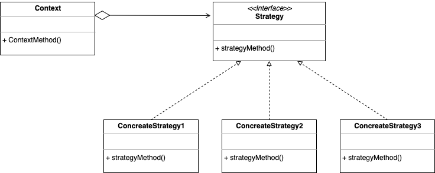
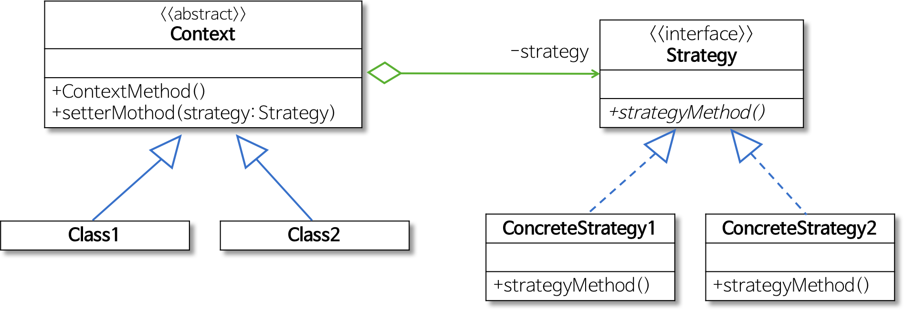
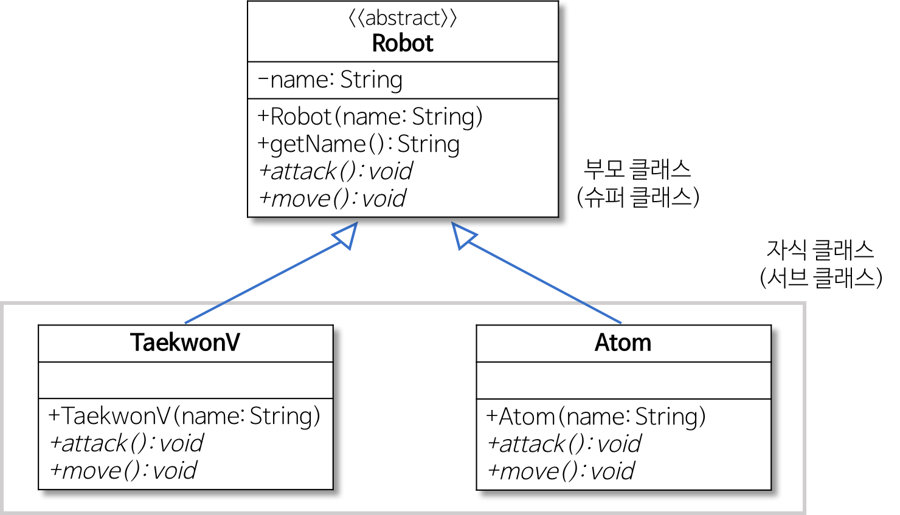
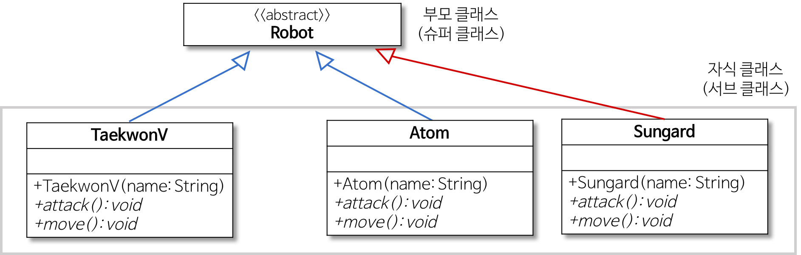
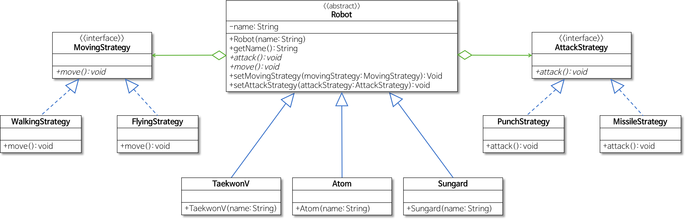

# Strategy Pattern

[스트래티지 패턴(Strategy Pattern)](https://jdm.kr/blog/54)

[전략 패턴(strategy pattern)](https://johngrib.github.io/wiki/strategy-pattern/)

[🙈[디자인패턴] 전략 패턴 ( Strategy Pattern )🐵](https://victorydntmd.tistory.com/292)

[디자인 패턴 : 전략패턴이란?](https://velog.io/@kyle/%EB%94%94%EC%9E%90%EC%9D%B8-%ED%8C%A8%ED%84%B4-%EC%A0%84%EB%9E%B5%ED%8C%A8%ED%84%B4%EC%9D%B4%EB%9E%80)

[[디자인 패턴] 전략 패턴(Strategy Pattern)](https://velog.io/@y_dragonrise/%EB%94%94%EC%9E%90%EC%9D%B8-%ED%8C%A8%ED%84%B4-%EC%A0%84%EB%9E%B5-%ED%8C%A8%ED%84%B4Strategy-Pattern)

[[디자인패턴/Design Pattern] Strategy 패턴 / 전략 패턴](https://lee1535.tistory.com/93)

[[Design Pattern] 스트래티지 패턴이란](https://gmlwjd9405.github.io/2018/07/06/strategy-pattern.html)

전략 패턴 또는 스트래티지 패턴(Strategy Pattern)

어떤 것을 유연하게 표현하는 것에 초점을 맞춘 디자인 패턴

전략 패턴을 이용하면 갑작스런 알고리즘 변화에도 유연하게 대처할 수 있다. 알고리즘을 캡슐화하기 때문이다. 따라서 알고리즘이 변경되어도 프로세스의 큰 틀을 바꾸지 않고도 유연한 프로그래밍을 할 수 있다.

----

> 동일 계열의 알고리즘을 정의하고 상호교환이 가능하게 하다

전략 패턴은 스트래티지 패턴, 정책 패턴(Policy)이라고도 불린다.

## 의도

GoF 책에서는 다음과 같이 전략 패턴의 의도를 밝힌다.

> 동일 계열의 알고리즘군을 정의하고, 각 알고리즘을 캡슐화하여 이들의 상호교환이 가능하도록 만듭니다. 알고리즘을 사용하는 클라이언트와 상관없이 독립적으로 알고리즘을 다양하게 변경할 수 있게 합니다.

---

- 객체들이 할 수 있는 각 행위에 대해 전략 클래스를 생성하고, 유사한 행위들을 캡슐화하는 인터페이스를 정의하여 객체의 행위를 동적으로 바꾸고 싶은 경우 직접 행위를 수정하지 않고 전략을 바꿔주기만 함으로써 행위를 유연하게 확장하는 방법
- 간단히 말해서, 객체의 행위 각각을 전략으로 만들고 동적으로 행위의 수정이 필요한 경우 전략을 바꾸는 것만으로도 행위의 수정이 가능하도록 함

- 전략 패턴을 사용하지 않고 행위를 변경했을 때의 문제점
    1. OCP 위배
    2. 시스템이 커져서 확장될 경우 메서드의 중복 문제 발생
    
---

> 전략 패턴(Strategy Pattern) 또는 정책 패턴(Policy Pattern)은 실행 중에 알고리즘을 선택할 수 있는 하는 행위 소프트웨어 디자인 패턴이다. 전략 패턴은 특정한 계열의 알고리즘들을 정의하고 각 알고리즘을 캡슐화하며 이 알고리즘들을 해당 계열 안에서 상호교체가 가능하게 만든다. 전략은 알고리즘을 사용하는 클라이언트와는 독립적으로 다양하게 만든다. 전략은 유연하고 재사용가능한 객체지향 소프트웨어를 어떻게 설계하는지 기술하기 위해 디자인 패턴을 보급시킨 디자인 패턴(Gamma 외)이라는 영향력 있는 책에 포함된 패턴들 가운데 하나이다.  - 위키피디아

전략패턴이란 특정 컨텍스트에서 알고리즘을 별도로 분리하는 설계 방법을 의미한다.

---

- 전략을 쉽게 바꿀 수 있게 해주는 패턴
- 같은 문제를 해결하는 여러 알고리즘이 클래스 별로 캡슐화되어 있고 이들이 필요할 때 교체할 수 있도록 함으로써 동일한 문제를 다른 알고리즘으로 해결할 수 있게 하는 패턴
- 전략: 어떤 목적을 달성하기 위해 일을 수행하는 방식, 비즈니스 규칙, 문제를 해결하는 알고리즘
  - ex) 게임 프로그래밍에서 게임 캐릭터가 처한 상황에 따라 공격이나 행동하는 방식을 바꿈

---

- 알고리즘군을 정의하고 각각 캡슐화해서 교환하며 사용할 수 있도록 만드는 방식입니다. 전략 패턴을 활용하면 알고리즘을 사용하는 클라이언트와는 독립적으로 알고리즘을 변경할 수 있습니다. 즉, 알고리즘의 인터페이스(API) 부분만 변경해서 사용할 수 있도록 할 수 있습니다.
- 람다를 사용하면 위임이라는 느슨한 연결을 사용하고 있으므로 알고리즘을 용이하게 교환할 수 있습니다.

---

## 장점

- 컨텍스트 코드의 변경 없이 새로운 전략을 추가할 수 있다.
    
    -> 요구사항이 변경되었을 때, 기존의 코드를 변경하지 않아도 된다.

    -> 새로운 전략에 대해서 새로운 클래스로 관리하기 때문에 OCP 원칙을 준수할 수 있다.

## 단점

- 컨텍스트에 적용되는 알고리즘이 한두개면 분기를 타는 것이 편한 경우도 있다. 하지만 요구사항이 변경될 여지가 있고 변화의 형태의 다양함이 어느정도 보장될 때 전략패턴을 고려해야 한다.

- 전략패턴은 추상화 기법이기 때문에 단순한 경우에도 전략패턴을 사용해야 하는 경우도 있다. 예를 들어 랜덤한 로직을 테스트하거나 Mock 객체를 생성하여 컨트롤러를 테스트하는 경우 등이다.

## 구조

- `Strategy`

  인터페이스나 추상 클래스로 외부에서 동일한 방식으로 알고리즘을 호출하는 방법 명시

  -> 전략을 이용하기 위한 인터페이스(API)를 결정함

- `ConcreteStrategy`

  전략 패턴에서 명시한 알고리즘을 실제로 구현한 클래스

  -> 전략을 실제로 구현하는 역할

- `Context`

  전략 패턴을 이용하는 역할을 수행하며, 필요에 따라 동적으로 구체적인 전략을 바꿀 수 있도록 setter 메서드 제공

  -> 전략의 인터페이스(API)를 호출해서 이용하는 역할

## 관련 패턴

- Flyweight패턴
  
    ConcreteStrategy 역할은 해당 패턴을 사용해서 복수의 장소에서 공유 가능

- Abstract Factory 패턴
    
    알고리즘뿐만 아니라 공장, 부품, 제품을 모두 교체 가능

- State 패턴
  
    비슷한 방식이지만, 알고리즘이 아닌 '상태' 를 변화하는 방식을 위임

---

- 행위를 클래스로 캡슐화해 동적으로 행위를 자유롭게 바꿀 수 있게 해주는 패턴
  - 같은 문제를 해결하는 여러 알고리즘이 클래스 별로 캡슐화되어 있고, 이들이 필요할 때 교체할 수 있도록 함으로써 동일한 문제를 다른 알고리즘으로 해결할 수 있게 하는 디자인 패턴
  - 행위 패턴(Behavioral) 중 하나
- 전략을 쉽게 바꿀 수 있게 해주는 디자인 패턴
  
  전략: 어떤 목적을 달성하기 위해 일을 수행하는 방식, 비즈니스 규칙, 문제를 해결하는 알고리즘 등

- 역할
  - `Strategy`

    인터페이스나 추상 클래스로 외부에서 동일한 알고리즘을 호출하는 방법 명시    

  - `ConcreteStrategy`

    전략 패턴에서 명시한 알고리즘을 실제로 구현한 클래스    

  - `Context`
  
    - 전략 패턴을 이용하는 역할
    - 필요에 따라 동적으로 구체적인 전략을 바꿀 수 있도록 setter 메서드(집약 관계)를 제공함
  
- 행위(Behavioral) 패턴
  - 객체나 클래스 사이의 알고리즘이나 책임 분배에 관련된 패턴
  - 한 객체가 혼자 수행할 수 없는 작업을 여러 개의 객체로 어떻게 분배하는지, 또 그렇게 하면서도 객체 사이의 결합도를 어떻게 최소화하는지에 중점을 둠
  
- 집약 관계
  - 참조값을 인자로 받아 필드를 세팅하는 경우
  - 전체 객체의 라이프타임과 부분 객체의 라이프타임은 독립적
  - 즉, 전체 객체가 메모리에서 사라진다 해도 부분 객체는 사라지지 않음
  
## 예시 - 로봇 만들기

## 문제점

1. 기존 로봇의 공격 방법과 이동 방법을 수정하는 경우
    - 새로운 기능으로 변경하기 위해 기존 코드의 내용을 수정해야 하므로 OCP에 위배된다.
    - 또한 Robot의 서브클래스들의 내용이 중복된다. 이런 중복 상황은 많은 문제를 야기한다.
    - 만약 걷는 방식에 문제가 있거나 새로운 방식으로 수정하려면 모든 중복 코드를 일관성있게 변경해야만 한다.
2. 새로운 로봇을 만들어 기존의 공격 방법 또는 이동 방법을 추가/수정하는 경우
    - 기존 공격 방법 또는 이동 방법 메서드의 내용과 중복된다. 

## 해결책

문제를 해결하기 위해서는 무엇이 변화되었는지 찾은 후에 이를 클래스로 캡슐화해야 한다.

로봇 예제에서 변경되며 문제를 발생시키는 요인은 로봇의 이동 방식과 공격 방식이다. 이를 캡슐화하려면 외부에서 구체적인 이동 방식과 공격 방식을 담은 구체적인 클래스들을 은닉해야 한다.

공격과 이동을 위한 위한 인터페이스를 각각 만들고 이들을 실제 실현한 클래스를 만들어야 한다.

