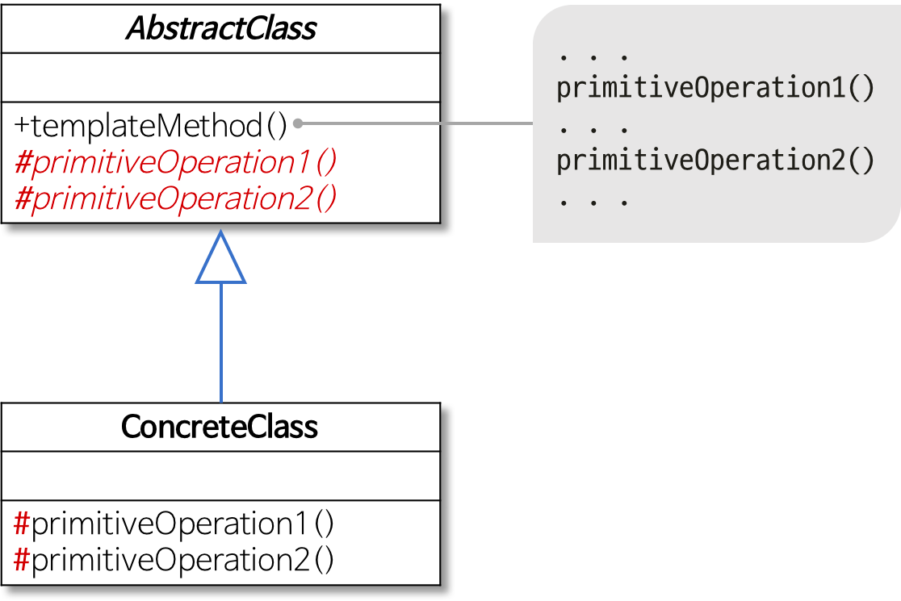
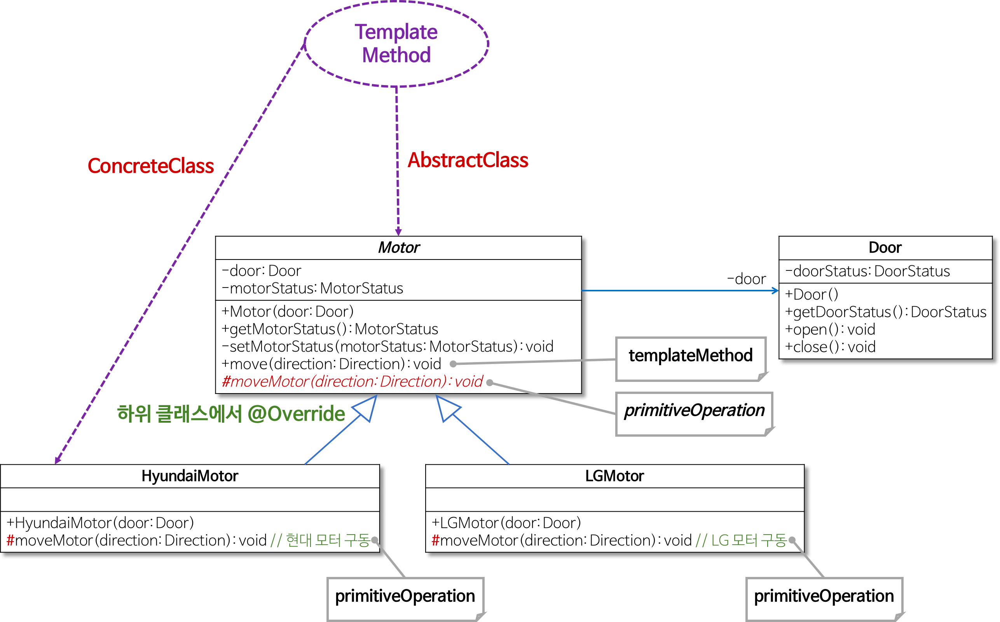
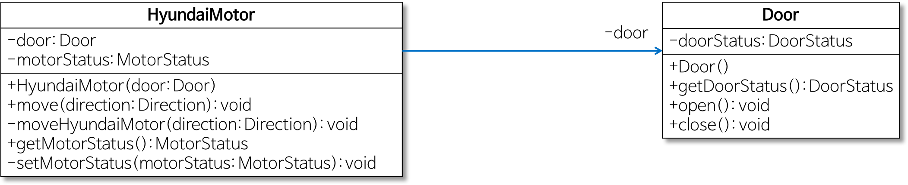
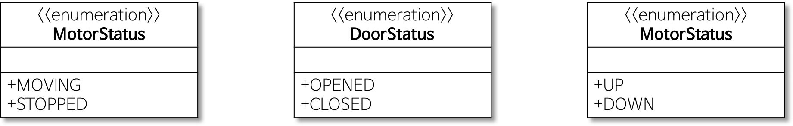
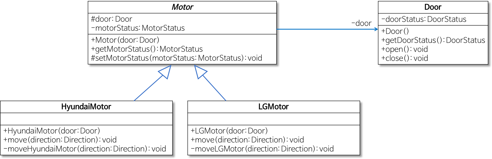
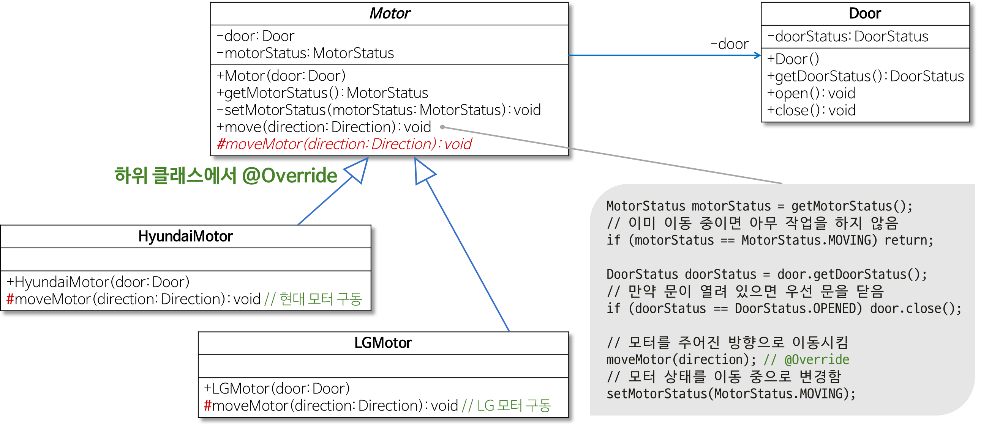

# Template Method Pattern

> prepareOther 메서드가 훅 메서드(= 훅 연산, 필요하다면 서브클래스에서 확장할 수 있는 기본적인 행동을 제공하는 메서드)다. 그리고 personWantsOther 메서드는 훅 메서드를 후킹하는 역할만 한다.

[템플릿 메소드 패턴 (Template Method Pattern)](https://johngrib.github.io/wiki/template-method-pattern/)

[템플릿 메소드 패턴(Template Method Pattern)](https://jdm.kr/blog/116)

[[Design Pattern] 템플릿 메서드 패턴이란](https://gmlwjd9405.github.io/2018/07/13/template-method-pattern.html)

[디자인패턴 - 템플릿 메소드 패턴](https://yaboong.github.io/design-pattern/2018/09/27/template-method-pattern/)

> 알고리즘의 일부 단계를 서브클래스에 정의한다

> 객체의 연산에는 알고리즘의 뼈대만을 정의하고 각 단계에서 수행할 구체적 처리는 서브클래스 쪽으로 미룹니다. 알고리즘의 구조 자체는 그대로 놔둔 채 알고리즘 각 단계 처리를 서브클래스에서 재정의할 수 있게 합니다.

## 용어
- 템플렛 메소드
    - 필수 처리 절차를 정의한 메소드
    - 서브클래스가 오버라이드하는 추상 메소드들을 사용하여 알고리즘을 정의하는 메소드
- 훅 연산(hook operation)
    - 필요하다면 서브클래스에서 확장할 수 있는 기본적인 행동을 제공하는 연산(메소드)
    - 기본적으로는 아무 내용도 정의하지 않는다.
    
## 구현 팁
- 템플릿 메소드가 호출하는 메소드들을 템플릿 메소드만 호출할 수 있게 하는 것을 고려한다.
    - `protected` 접근 제한을 사용하면 된다.
- 템플릿 메소드는 오버라이드할 수 없도록 구현하는 것을 고려한다.
    - 자바라면 템플릿 메소드에 `final`을 달아주면 된다.
- 구현해야 하는 abstract 메소드의 수가 너무 많아지지 않도록 주의한다.
- 재정의할 abstract 메소드는 식별하기 쉽도록 접두사를 붙여주자
    - 예를 들어 메소드 이름이 `Do`로 시작하도록 한다.
    
## 예제

기존

```java
public class Coffee {
    // 커피 만드는 방법
    void prepareRecipe() {
        boilWater();
        brewCoffeeGrinds();
        pourInCup();
        addSugarAndMilk();
    }
    public void boilWater() {
        System.out.println("물 끓이기");
    }
    public void brewCoffeeGrinds() {
        System.out.println("커피 우려내기");
    }
    public void pourInCup() {
        System.out.println("컵에 따르기");
    }
    public void addSugarAndMilk() {
        System.out.println("설탕과 우유 추가하기");
    }
}
```

```java
public class Tea {
    // 홍차 만드는 방법
    void prepareRecipe() {
        boilWater();
        steepTeaBag();
        pourInCup();
        addLemon();
    }
    public void boilWater() {
        System.out.println("물 끓이기");
    }
    public void steepTeaBag() {
        System.out.println("차 우려내기");
    }
    public void pourInCup() {
        System.out.println("컵에 따르기");
    }
    public void addLemon() {
        System.out.println("레몬 추가하기");
    }
}
```

**템플릿 메소드 패턴으로 리팩토링**

공통적인 부분을 뽑아 추상 클래스를 만든다.

알고리즘의 세부 항목에서 차이가 있는 곳은 추상 메서드로 정의한다.

```java
public abstract class CoffeineBeverage {
    // 템플릿 메소드: 알고리즘을 가지고 있다
    final void prepareRecipe() {
        boilWater();
        brew();
        pourInCup();
        addCondiments();
    }

    abstract void brew(); // 서브클래스에서 구현
    abstract void addCondiments(); // 서브클래스에서 구현

    protected void boilWater() {
        System.out.println("물 끓이기");
    }

    protected void pourInCup() {
        System.out.println("컵에 따르기");
    }
}
```

```java
public class Coffee extends CoffeineBeverage {
    public void brew() {
        System.out.println("커피 우려내기");
    }
    public void addCondiments() {
        System.out.println("설탕과 우유 추가하기");
    }
}
```

```java
public class Tea extends CoffeineBeverage {
    public void brew() {
        System.out.println("차 우려내기");
    }
    public void addCondiments() {
        System.out.println("레몬 추가하기");
    }
}
```

## hook 메소드

- 서브클래스 구현 시 융통성을 발휘하기 위한 메소드
- 추상 클래스에서 선언하지만 기본적인 내용만 구현되어 있거나 내용이 비어 있는 메소드

```java
public abstract class CoffeineBeverage {
    // 템플릿 메소드: 알고리즘을 가지고 있다
    final void prepareRecipe() {
        boilWater();
        brew();
        pourInCup();
        if (customWantsCondiments()) {
            addCondiments();
        }
    }

    abstract void brew(); // 서브클래스에서 구현
    abstract void addCondiments(); // 서브클래스에서 구현

    void boilWater() {
        System.out.println("물 끓이기");
    }

    void pourInCup() {
        System.out.println("컵에 따르기");
    }
    
    // hook 메소드
    boolean customerWantsCondiments() {
        return true;
    }
}
```

## 람다를 이용해 서브 클래스 제거하기 [Link](http://www.javamagazine.mozaicreader.com/NovDec2016/LinkedIn#&pageSet=57&page=0)

1개의 추상 메소드를 사용하는 템플릿 메소드가 있다. 이 코드를 사용하려면 서브 클래스를 작성해야 한다.

(<https://tourspace.tistory.com/6>)

```java
abstract class OnlineBanking {
    // 템플릿 메소드
    public void processCustomer(int id) {
        Customer c = Database.getCustomerWithId(id);
        makeCustomerHappy(c);
    }
    abstract void makeCustomerHappy(Customer c);
}
```

```java
class OnlineBankingKorea extends OnlineBanking {
    @Override
    void makeCustomerHappy(Customer c) {
        System.out.println("안녕 " + c.getName());
    }
```

```java
new OnlineBankingKorea().processCustomer(1111);
```

구현해야 할 추상 메소드가 하나 뿐이므로 람다의 사용을 고려해볼 수 있다.

`OnlineBanking`에서 `abstract` 키워드를 삭제하고, `processCustomer` 메소드가 `Consumer`를 받도록 수정한다. 그럼 이제 상속 없이 `OnlineBanking` 클래스를 사용할 수 있다.

```java
class OnlineBanking {
    public void processCustomer(int id, Consumer<Customer> makeCustomerHappy) {
        Customer c = Database.getCustomerWithId(id);
        makeCustomerHappy.accept(c);
    }
}
```

```java
new OnlineBanking()
        .processCustomer(1337,
            (Customer c) -> System.out.println("안녕하세요" + c.getName())
        );
```

## 인용
Allen Holub은 "실용주의 디자인 패턴"에서 이 패턴에 대해 다음과 같이 불평했다.

> Template Method 패턴은 가능한 절제해 사용해야 한다. 클래스 자체가 전적으로 파생 클래스의 커스터마이징에 의존하는 일종의 '프레임워크'가 되면 이 역시 매우 부서지기 쉽기 때문이다. 기반 클래스는 매우 깨지기 쉽다. 나는 MFC에서 프로그래밍을 할 때, 마이크로소프트가 새로운 버전을 릴리즈할 때마다 전체 애플리케이션을 재작성해야만 했던 악몽을 떨쳐버릴 수가 없다. 종종 코드는 잘 컴파일되지만, 몇몇 기반 클래스의 메소드가 변경되어 프로그램이 제대로 실행되지 않았던 것이다.

---

## 훅 메소드(hook method)

`abstract` 키워드를 붙이면 상속받은 클래스는 반드시 해당 메소드를 구현해야 하지만 `abstract` 키워드를 붙이지 않고 훅 메소드로 만들면 반드시 구현할 필요가 없습니다. 상속 받은 클래스에서 선택적으로 오버라이드할 수 있다는 얘기가 됩니다.

> abstract 키워드를 붙이지 않고 훅 메소드를 만들면 반드시 구현할 필요가 없다. 그러므로 서브 클래스에서 구현해야 하는 부담이 적어진다.

## 왜 사용할까요?

템플릿 메소드 패턴은 알고리즘의 뼈대를 맞추기 위해 사용합니다. 즉, 전체적인 레이아웃을 통일시키지만 상속받은 클래스로 하여금 어느정도 유연성을 주도록 하는 디자인 패턴입니다.

추상 메소드(abstract method)와 훅 메소드(hook method)를 적절히 사용해서 전체적인 알고리즘의 뼈대를 유지하되 유연하게 기능을 변경할 수 있도록 하고자 할 때 사용하면 유용할 것입니다.

(예시 - battle 생략)

---

## 템플릿 메서드 패턴이란

- 어떤 작업을 처리하는 일부분을 **서브 클래스로 캡슐화해** 전체 일을 수행하는 구조는 바꾸지 않으면서 특정 단계에서 수행하는 내역을 바꾸는 패턴
  - 즉, **전체적으로는 동일하면서 부분적으로는 다른 구문으로 구성된 메서드의 코드 중복을 최소화**할 때 유용하다.
  - 다른 관점에서 보면 동일한 기능을 상위 클래스에서 정의하면서 확장/변화가 필요한 부분만 서브 클래스에서 구현할 수 있도록 한다.
  - 예를 들어, 전체적인 알고리즘은 상위 클래스에서 구현하면서 다른 부분은 하위 클래스에서 구현할 수 있도록 함으로써 전체적인 알고리즘 코드를 재사용하는 데 유용하도록 한다.
  - 행위(Behavioral) 패턴의 하나
  
    
- 역할별 수행하는 작업
  - AbstractClass
    - 템플릿 메서드를 정의하는 클래스
    - 하위 클래스의 공통 알고리즘을 정의하고 하위 클래스에서 구현될 기능을 primitive 메서드 또는 hook 메서드로 정의하는 클래스
  - ConcreteClass
    - 물려받은 primitive 메서드 또는 hook 메서드를 구현하는 클래스
    - 상위 클래스에 구현된 템플릿 메서드의 일반적인 알고리즘에서 하위 클래스에 적합하게 primitive 메서드나 hook 메서드를 오버라이드하는 클래스 
- 참고
  - 행위(Behavioral) 패턴
    - 객체나 클래스 사이의 알고리즘이나 책임 분배에 관련된 패턴
    - 한 객체가 혼자 수행할 수 없는 작업을 여러 개의 객체로 어떻게 분배하는지, 또 그렇게 하면서도 객체 사이의 결합도를 최소화하는 것에 중점을 둔다.

(예시 - motor 생략)

- `AbstractClass`: Motor 클래스
- `ConcreteClass`: HyundaiMotor 클래스와 LGMotor 클래스
- `TemplateMethod`: Motor 클래스의 move 메서드
- `Primitive / Hook Method`: move 메서드에서 호출되면서 하위 클래스에서 오버라이드될 필요가 있는 moveMotor 메서드




LG 모터 추가 시 중복 코드 문제 해결


move 메서드 부분 중복 코드 문제 해결


---

템플릿 메소드 패턴의 정의로 GoF Design Patterns 의 정의가 가장 깔끔한 것 같다.

> Defines the skeleton of an algorithm in a method, deferring some steps to subclasses. Template Method lets subclasses redefine certain steps of an algorithm without changing the algorithms structure. – GoF Design Patterns  
> 알고리즘의 구조를 메소드에 정의하고, 하위 클래스에서 알고리즘 구조의 변경없이 알고리즘을 재정의 하는 패턴이다. 알고리즘이 단계별로 나누어 지거나, 같은 역할을 하는 메소드이지만 여러곳에서 다른형태로 사용이 필요한 경우 유용한 패턴이다.

토비의 스프링에서는 아래와 같이 정의한다.

> 상속을 통해 슈퍼클래스의 기능을 확장할 때 사용하는 가장 대표적인 방법. 변하지 않는 기능은 슈퍼클래스에 만들어두고 자주 변경되며 확장할 기능은 서브클래스에서 만들도록 한다. – 토비의 스프링 3.1
